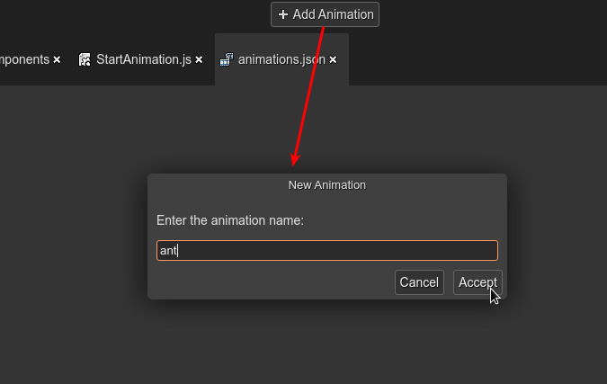
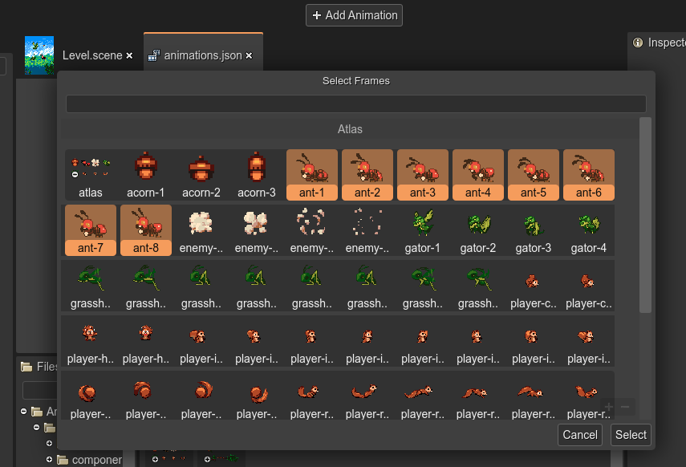
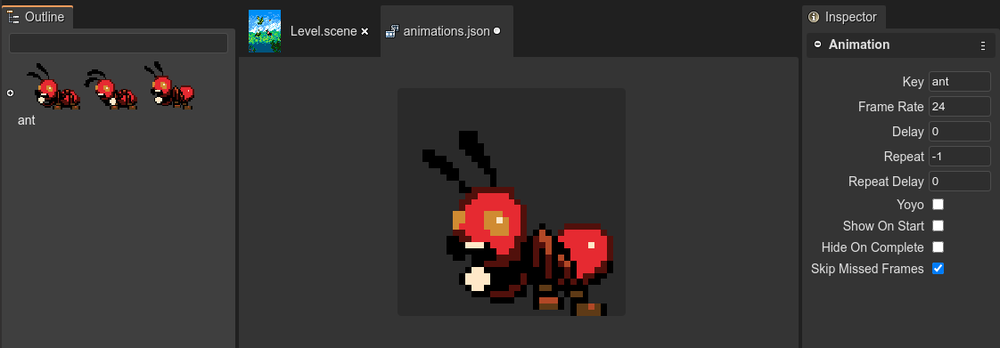

.. include:: ../_header.rst

Adding animations to the file
-----------------------------

To create a new animation, press the **Add Animation** button in the toolbar. It shows a dialog to enter the animation name:

Because empty animations are not allowed, it opens a dialog to select the initial animation's frames. If you select a texture atlas or spritesheet, all the frames will be added to the animation:

