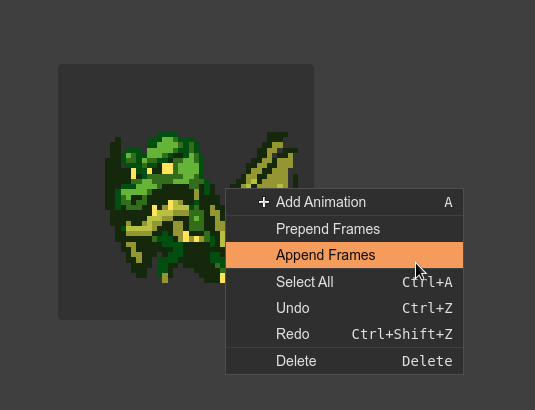
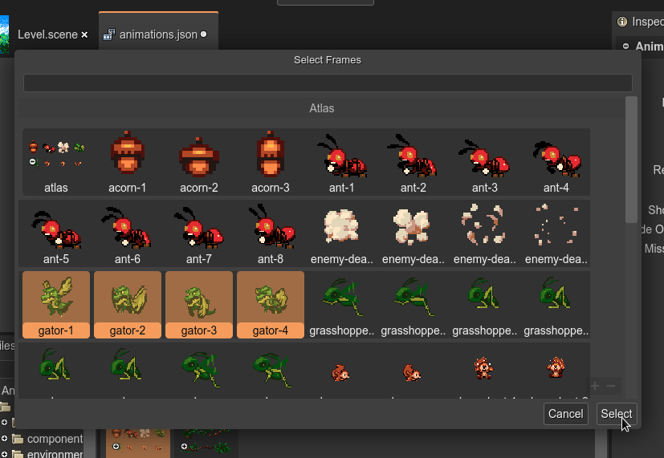

.. include:: ../_header.rst

Adding and deleting frames
--------------------------

The quickest way to create the animations is using the `provided automatic process <auto-build-animations.html>`_. However, you may want to change the frames of the animations, delete them or add them.

To delete a couple of frames, select them in the |OutlineView|_ and execute the **Delete** command (press the ``Del`` key or select **Delete** in the context menu).

To add frames, select an animation and choose to insert them at the start or the end:

It opens a dialog with all the images-related assets (frames, texture maps, sprite-sheets). You can select the frames to add:

