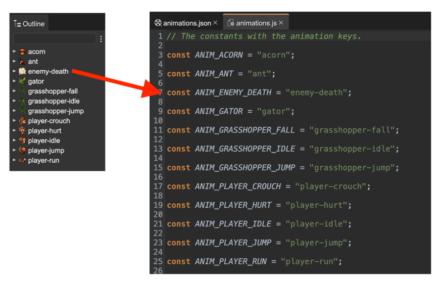
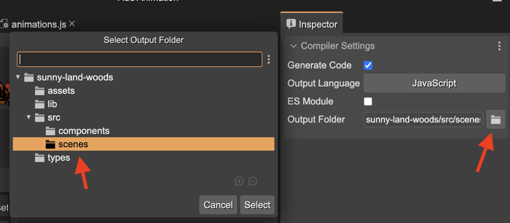

.. include:: ../_header.rst

Compiling animation key constants
---------------------------------

You can enable compiling a code file with constant definitions for the animation keys.

For each animation, the compiler will generate a constant declaration. Like this:

If you have a lot of animations in your game, we recommend using this feature. You can reference animations using constants (and auto-completion) instead of writing the key names "by hand".

By default, the compiler is disabled. You can enable it in the **Compiler Settings** section. This section shows when no animation is selected:

.. image:: ../images/animations-editor-compiler-settings-20221114.webp
 :alt: Compiler settings.

This a table with the parameters:

* **Generate Code**: Enable the code generation.
* **Output Language**: Choose between JavaScript and TypeScript.
* **ES Module**: If selected, it generates an ES module file.
* **Output Folder**: Choose the parent folder for the output file. If you are using a WebPack or similar bundler, you may want to generate the code in a sub-directory of the `src` folder.

