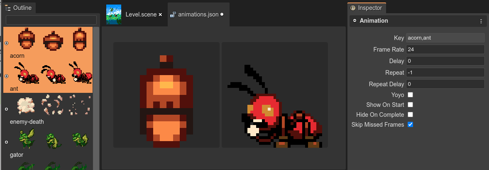

.. include:: ../_header.rst

Editing the properties of the animations
----------------------------------------

These are the properties of an animation:

**Key**: The identifier of the animations. Used to play the animation in a sprite: ``sprite.play("walk")``.

**Frame Rate**: The frame rate of playback in frames per second (default 24).

**Delay**: Delay before starting playback. Value given in milliseconds.

**Repeat**: Number of times to repeat the animation (-1 for infinity).

**Repeat Delay**: Delay before the animation repeats. Value given in milliseconds.

**Yoyo**: Should the animation yoyo? (reverse back down to the start) before repeating?

**Show On Start**: Should sprite.visible = true when the animation starts to play?

**Hide On Complete**: Should ``sprite.visible = false`` when the animation finishes.

**Skip Missed Frames**: Skip frames if the time lags, or always advanced anyway?

By default, the editor shows all the animations and in the |InspectorView|_ shows the properties of all of them. However, you can click on an animation in the editor, to edit the properties of that single animation. Or select a couple of animations in the |OutlineView|_.

