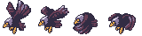

.. include:: ../_header.rst

Animations Editor
-----------------

.. toctree::
    :maxdepth: 1

    new-file-wizard
    add-animation
    auto-build-animations
    edit-animations-properties

`Sprite animations <https://photonstorm.github.io/phaser3-docs/Phaser.Animations.Animation.html>`_ are the most frequent option to animate characters in Phaser_ games. The principle of this animation technique is the displaying of a sequence of images (frames), at a given "speed" or frame rate.

Animation:

.. image:: ../images/eagle.gif
  :alt: Eagle animation.

Animation frames:

In Phaser_ v3, the animations are `created <https://photonstorm.github.io/phaser3-docs/Phaser.Animations.AnimationManager.html#create__anchor>`_ as global objects, in the `animations manager <https://photonstorm.github.io/phaser3-docs/Phaser.Animations.AnimationManager.html>`_:

You can create a single animation:

.. code::

    this.anims.create({
        "key": "acorn",
        "frameRate": 12,
        "repeat": -1,
        "frames": [
            {
            "key": "atlas",
            "frame": "acorn-1"
            },
            {
            "key": "atlas",
            "frame": "acorn-2"
            },
            {
            "key": "atlas",
            "frame": "acorn-3"
            }
        ]
    });

Or multiple animations:

.. code::

    this.anims.fromJSON(
        "anims": [
            { 
                "key": "acorn", 
                // ....
            },
            { 
                "key": "player", 
                // ....
            }
        ]
    );

in the practice, you create all the animations once in the game, probably in the preloader scene. Then, you can play an animation on a sprite object passing the animation key to the `play(..) <https://photonstorm.github.io/phaser3-docs/Phaser.GameObjects.Sprite.html#play__anchor>`_ method:

.. code::

    mySprite.play("acorn");

Other way to create the animations is packing them all in a single JSON file, and load the file using the `this.load.animation(..) <https://photonstorm.github.io/phaser3-docs/Phaser.Loader.LoaderPlugin.html#animation__anchor>`_ method:

.. code::

    this.load.animations("my-anims", "assets/animations.json");

|PhaserEditor|_ provides the |AnimationsEditor|_, to create the animations JSON file. So, the workflow is very simple:

* Create the animations JSON file with the |AnimationsEditor|_.

* Import the animations JSON file into an **Asset Pack** file with the |AssetPackEditor|_.

* Play the animations in your code, with the `play(..)`_ method.

