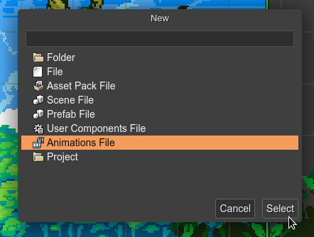
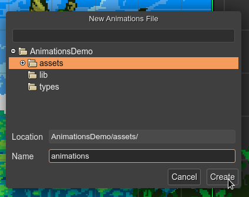
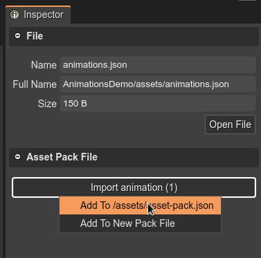

.. include:: ../_header.rst

Create a new Animations file
````````````````````````````

To create an Animations file, open the `New File dialog <../workbench/new-file-dialog.html>`_ and select the **Animations File** option:



It opens the **New Animations File** dialog and asks for the name of the file and the location:



The file is created and opened in the |AnimationsEditor|_.

In the majority of the cases, you want to add the animations file to an |AssetPackFile|_. To do this, select the file in the |FilesView|_ and the |InspectorView|_ will show you the option to add the animations to an |AssetPackFile|_:



Also, you can load the animations file using the `Animations Loader <https://photonstorm.github.io/phaser3-docs/Phaser.Loader.LoaderPlugin#animation>`_:

.. code::
    
    this.load.animation("playerAnimations", "assets/animations.json");
