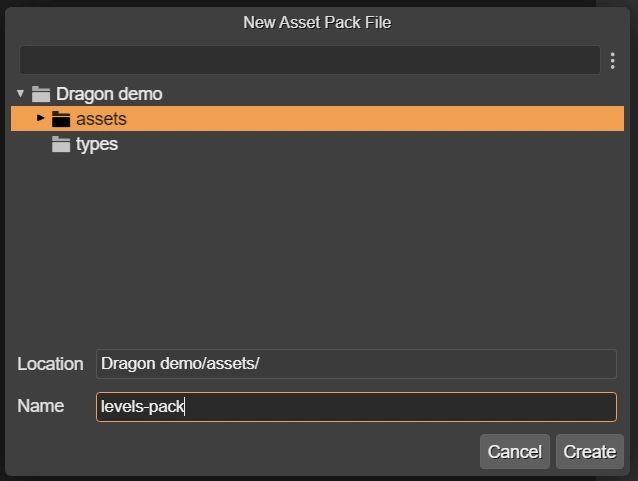

.. include:: ../_header.rst

Create a new Asset Pack file
----------------------------

The project templates provided by |PhaserEditor|_ contain at least one |AssetPackFile|_. You can use it to configure the assets of your project. However, if you want to load a group of assets at a certain moment of the game, and another group in another moment of the game, you can create a new |AssetPackFile|_.

To create the new file, open the `New File dialog <../workbench/new-file-dialog.html>`_ and select the **Asset Pack file** option. It will open the **New Asset Pack File** dialog:

Select the folder where you want to create the file and write the file's name. You don't need to add the ``.json`` extension to the file, the dialog does this automatically.

When the file is created, the IDE opens it in the |AssetPackEditor|_.
