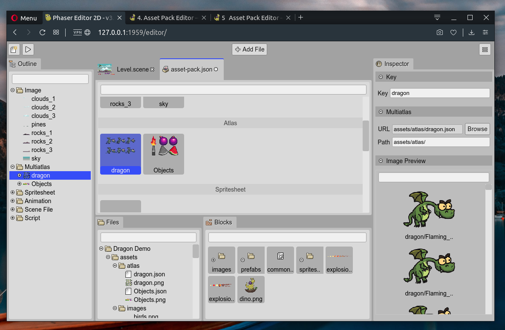

.. include:: ../_header.rst

Editor content layout
---------------------

The |AssetPackEditor|_ layout is focused on provides a very visual feedback of the file configurations. The editor is split in sections, and each section is dedicated to a particular file type. Inside the section, the file configurations are shown in a row layout.

The editor uses a `content viewer <../misc/content-viewers.html>`_, so it shows inline preview of the elements, it can be zoomed in/out (pressing ``Shift`` and rolling the mouse wheel) and filter its context.

In addition, the |OutlineView|_ provides an hierarchical presentation of the editor content.

