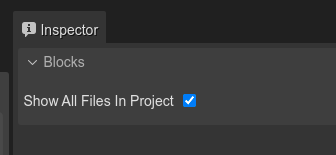

.. include:: ../_header.rst

Importing from the Blocks view
~~~~~~~~~~~~~~~~~~~~~~~~~~~~~~

The |BlocksView|_ is a general-purpose view that connects with the active editor and provides the "blocks" needed to build the objects of the editor.

When the |AssetPackEditor|_ is active, the `Blocks view`_ shows the files that are candidates to be imported. A file is a candidate to be imported if:

* The file belongs to the folder, or sub-folder, of the |AssetPackFile|_ that is the input of the editor (unless you disable this restriction, as discussed at the end of this section).

* The file is not present in any other |AssetPackFile|_ in the project.

* If the file has a content type or file name extension that we know is never loaded in games: 

 * TypeScript files (``.ts``).

 * |SceneEditor|_ files (``.scene``).

 * Another |AssetPackFile|_.

These are the steps:

#. Select the files to be imported in the |BlocksView|_.

#. Select one of the importing options listed in the **Asset Pack Entry** section of the |InspectorView|_.

  .. image:: ../images/asset-pack-add-file-from-blocks-view-01012022.webp
   :alt: Import files from Blocks view.

#. When the files are imported, edit the new configurations in the |InspectorView|_.

This is simpler than using the |MainToolbar|_ button: once you select the files the editor shows only the relevant importing options, based on their content type and name.

Showing all files in the Blocks view
^^^^^^^^^^^^^^^^^^^^^^^^^^^^^^^^^^^^

As we mentioned before, the Blocks view only shows the files in the same folder (or sub-folder) as the |AssetPackFile|_. You can disable this restriction by checking the **Show All Files in Project** settings in the Inspector view:

