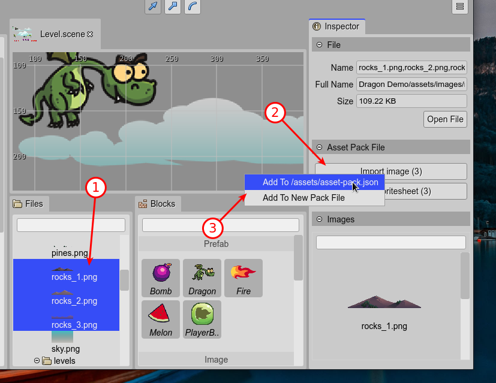
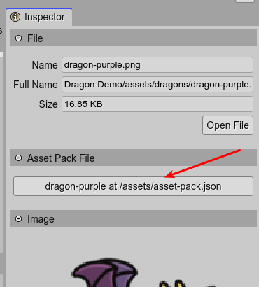

.. include:: ../_header.rst

Importing from the Files view
-----------------------------

Importing from the |FilesView|_ is very similar to importing from the |BlocksView|_, but you don't need to open the |AssetPackEditor|_.

Whether or not the |AssetPackEditor|_ is active, you can select a one or more file in the |FilesView|_ and, in the **Asset Pack Entry** section of the |InspectorView|_, select the option to import the file into an existent |AssetPackFile|_ or a new one.

If any file you selected in the |FilesView|_ already has a configuration entry in an |AssetPackFile|_, then the |InspectorView|_ shows a button to open that |AssetPackFile|_ in the |AssetPackEditor|_.

