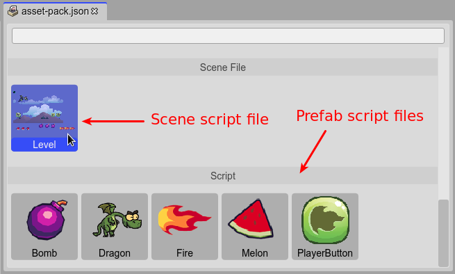

.. include:: ../_header.rst

Importing JavaScript files
--------------------------

In the JavaScript development world, there are multiple ways to load the script files. The common is to load them using the ``<script>`` tag in the ``index.html`` file. Some frameworks allow loading script files at any time, via JavaScript. Phaser_ provides different ways to load the scripts, each one with its purpose:

* ``this.load.script(...)`` `[docs] <https://photonstorm.github.io/phaser3-docs/Phaser.Loader.LoaderPlugin.html#script__anchor>`_: It load and execute the provided script files.

* ``this.load.scripts(...)`` `[docs] <https://photonstorm.github.io/phaser3-docs/Phaser.Loader.LoaderPlugin.html#scripts__anchor>`_: It loads a list of script files and execute them in the same order. Note in the ``script()`` method the files may be executed in random order. This can break your code if one file depends on another file that is not loaded yet.

* ``this.load.scenePlugin(...)`` `[docs] <https://photonstorm.github.io/phaser3-docs/Phaser.Loader.LoaderPlugin.html#scenePlugin__anchor>`_: It loads the script files and execute them, but assume them create new `Phaser.Scenes.ScenePlugin <https://photonstorm.github.io/phaser3-docs/Phaser.Loader.LoaderPlugin.html#Phaser.Scenes.ScenePlugin.html>`_ instances.

* ``this.load.sceneFile(...)`` `[docs] <https://photonstorm.github.io/phaser3-docs/Phaser.Loader.LoaderPlugin.html#sceneFile__anchor>`_: It loads the script files and execute them, but assume them create `Phaser.Scene <https://photonstorm.github.io/phaser3-docs/Phaser.Loader.LoaderPlugin.html#Phaser.Scene.html>`_ instances.

So the same Phaser_ framework can be used as a JavaScript packing/loading tool, and it has some clear advantages:

* You don't need a third-party tool to control the scripts loading.

* You can report loading progress of the script files just like you do with the other assets.

* The scripts can be added to the **Asset Pack** files using the |PhaserEditor|_ toolset.

By the way, when you add a JavaScript file to an |AssetPackFile|_, and that script is associated with a |SceneEditor|_ file (``.scene``), then the |AssetPackEditor|_ shows an inline preview of the scene, for easy identification.

