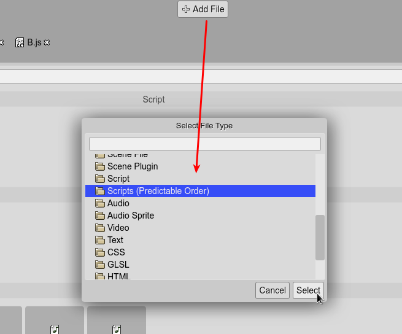
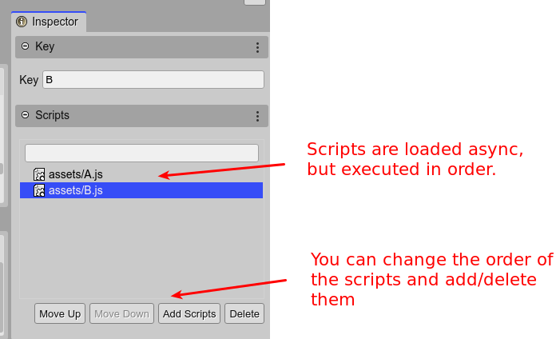

.. include:: ../_header.rst

Importing JavaScript files
--------------------------

In the JavaScript development world, there are multiple ways to load script files. The most common is to load them using the ``<script>`` tag in the ``index.html`` file. Some frameworks allow loading script files at any time, via JavaScript. Phaser_ provides different ways to load the scripts, each one with its purpose:

* ``this.load.script(...)`` `[docs] <https://photonstorm.github.io/phaser3-docs/Phaser.Loader.LoaderPlugin.html#script__anchor>`_: It loads and executes the provided script file or files in random order.  This can break your code if one script depends on another that is not loaded yet.

* ``this.load.scripts(...)`` `[docs] <https://photonstorm.github.io/phaser3-docs/Phaser.Loader.LoaderPlugin.html#scripts__anchor>`_: It loads a list of script files and executes them in the specified order (see the section below).

* ``this.load.scenePlugin(...)`` `[docs] <https://photonstorm.github.io/phaser3-docs/Phaser.Loader.LoaderPlugin.html#scenePlugin__anchor>`_: It loads and executes the script files, but assumes they create new `Phaser.Scenes.ScenePlugin <https://photonstorm.github.io/phaser3-docs/Phaser.Loader.LoaderPlugin.html#Phaser.Scenes.ScenePlugin.html>`_ instances.

* ``this.load.sceneFile(...)`` `[docs] <https://photonstorm.github.io/phaser3-docs/Phaser.Loader.LoaderPlugin.html#sceneFile__anchor>`_: It loads and executes the script files, but assumes they create `Phaser.Scene <https://photonstorm.github.io/phaser3-docs/Phaser.Loader.LoaderPlugin.html#Phaser.Scene.html>`_ instances.

So the same Phaser_ framework can be used as a JavaScript packing/loading tool, and it has a few clear advantages:

* You can load the scripts on demand when needed, such as when the game has many levels.

* You can report loading progress of script files, just like you do with other assets.

* Scripts can be added to an |AssetPackFile|_ using the |PhaserEditor|_ toolset.

By the way, when you add an entry for a JavaScript file to an |AssetPackFile|_, and that script is associated with a |SceneEditor|_ file (``.scene``), the |AssetPackEditor|_ shows an inline preview of the scene, for easy identification.

.. image:: ../images/asset-pack-editor-import-script-files-04082020.webp
  :alt: Scene JavaScript files are displayed with a scene screenshot.

Execution order of the scripts
``````````````````````````````

A missing class is a common error when you load scripts using the |AssetPackEditor|_. It happens when a class ``B`` in a script ``B.js`` extends a class ``A`` in the script ``A.js``, but ``B.js`` is executed before ``A.js``. The solution is to use the `Scripts file type <https://photonstorm.github.io/phaser3-docs/Phaser.Loader.LoaderPlugin.html#scripts__anchor>`_. With this method, you can set execution order of the files:




