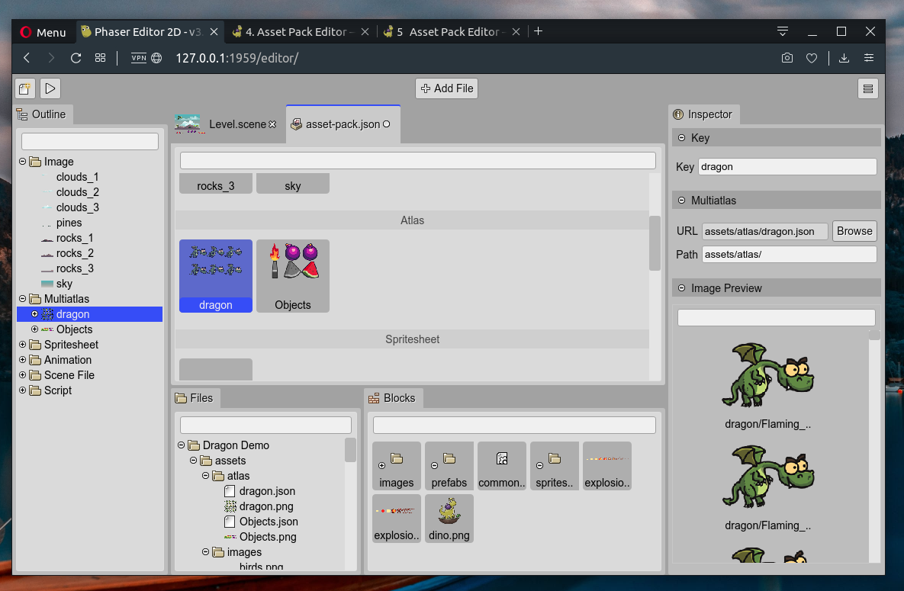

.. include:: ../_header.rst

.. highlight:: javascript

Asset Pack Editor
=================

.. toctree::

    create-asset-pack-file
    editor-content-layout
    add-file
    organizing-the-assets       
    outline-view
    inspector-view

In a Phaser_ game you load the files using the methods of the `Phaser.Loader.LoaderPlugin <https://photonstorm.github.io/phaser3-docs/Phaser.Loader.LoaderPlugin.html>`_ class. This is how you can `load a sprite-sheet <https://photonstorm.github.io/phaser3-docs/Phaser.Loader.LoaderPlugin.html#spritesheet__anchor>`_ file:

.. highlight:: javascript

.. code::

  this.load.spritesheet('bot', 'images/robot.png', { frameWidth: 32, frameHeight: 38 });

You pass a key (``'bot'``) to identify the file in the `game cache <https://photonstorm.github.io/phaser3-docs/Phaser.Cache.CacheManager.html>`_, the URL of the file (``'images/robot.png'``) and a sprite-sheet configuration object, with other information like the frame size.

Or you can load the file by passing a single argument, a `SpriteSheetFileConfig <https://photonstorm.github.io/phaser3-docs/Phaser.Types.Loader.FileTypes.html#.SpriteSheetFileConfig__anchor>`_ configuration object:

.. code::

 this.load.spritesheet({
    key: 'bot',
    url: 'images/robot.png',
    frameConfig: {
    frameWidth: 32,
    frameHeight: 38
    }
 });

Every file type can be loaded using its configuration object, that is just a JSON object. Following this logic, Phaser_ has an especial type of files that contains the configurations of other files, it is the |AssetPackFile|_.

You can load an |AssetPackFile|_ using the ``pack(...)`` method of the loader:

.. code::

 this.load.pack("level1", "assets/pack.json");

The |AssetPackEditor| allows to edit an |AssetPackFile|_, making it very easy to load the assets in your game. Instead of spending a precious amount of time writing the file configurations, with the |AssetPackEditor|_ you can import the files with a visual tool and smart operations.

The |AssetPackFile|_ is relevant in the IDE for two main reasons:

* It is a Phaser_ built-in format. This means, you can create an |AssetPackFile|_ with |PhaserEditor|_ and use it in any Phaser_ project, no matter if you are using other IDE. 
* Many of the tools provided by the IDE are based on Phaser_ (like the |SceneEditor|_ others that should be included).  This means, that we can reuse the |AssetPackFile|_ information to load the assets into the IDE internal tools.