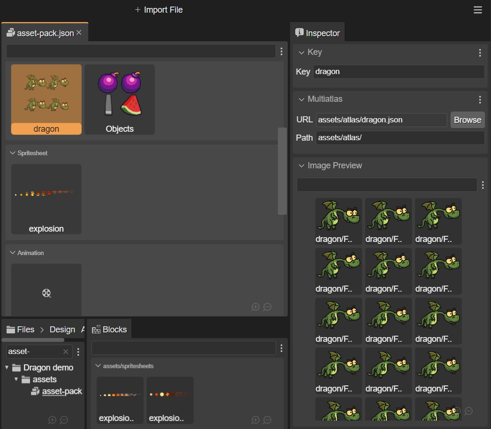

.. include:: ../_header.rst

Inspector view integration
--------------------------

The |InspectorView|_ connects with the active |AssetPackEditor|_ and shows property editors to change the file configurations.

In addition to property editors, in some cases, the |InspectorView|_ shows a preview of the selected configuration.

This preview section is shown when you select a file key in other parts of the IDE, like the |BlocksView|_ in the |SceneEditor|_.

