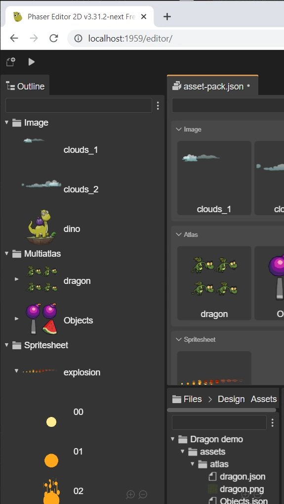

.. include:: ../_header.rst

Outline view integration
------------------------

The general purpose |OutlineView|_ connects with the active |AssetPackEditor|_ and shows all the file configurations grouped by type. In the case of complex files, like atlas or sprite-sheet files, it shows the frames too.

