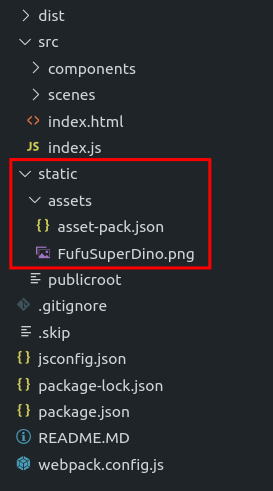
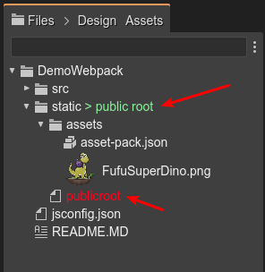

.. include:: ../_header.rst

Setting the root folder for the asset files
~~~~~~~~~~~~~~~~~~~~~~~~~~~~~~~~~~~~~~~~~~~

When you add an entry for a new file to an Asset Pack, the editor uses, as the URL, the project's relative path to the file. For example, if you add an image file with full path ``<project root>/assets/background.png``, then the URL in the Asset Pack entry is set to ``assets/background.png``.

That's fine for a lot of cases. However, if you use web bundlers, like |webpack|_ or Parcel, it could be different. Maybe the relative path of the assets is not the same in the project and the website.

Let's see an example. The |webpack|_ project template of |PhaserEditor|_ has this layout:

Notice that if you add an entry for the ``FufuSuperDino.png`` file to an asset pack, it sets the URL of the image to ``static/assets/FufuSuperDino.png``. However, the ``static`` folder is not present in the distribution build (in the website). It only copies its content to the distribution build folder. So, when you open the game in the browser, the path of the image file is ``assets/FufuSuperDino.png`` (without the ``static`` element).

Now, |PhaserEditor|_ allows changing the root folder for the assets. If you add an empty ``publicroot`` file, in the ``static`` folder, then the editor will build the file URL with the relative path to the ``<project root>/static`` folder:

The rule is simple. When you add an entry to an Asset Pack for a new file, it builds the file's URL using the relative path to a root folder. To find the root folder, it checks each parent folder of the Asset Pack file until it finds one containing a ``publicroot`` file.  That folder is then taken as the root folder to build the URL. If no ``publicroot`` file is found, it defaults to the root folder for the project.
