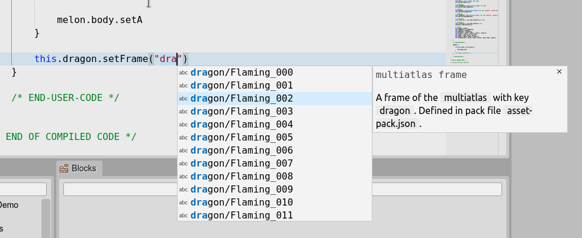

.. include:: ../_header.rst

Asset Pack keys auto-completion
```````````````````````````````

If the `advanced JavaScript coding <js-editor-advanced-features.html>`_ is enabled, the the JavaScript editor will include, the auto-completion list, the keys of every |AssetPackFile|_ of the project:


