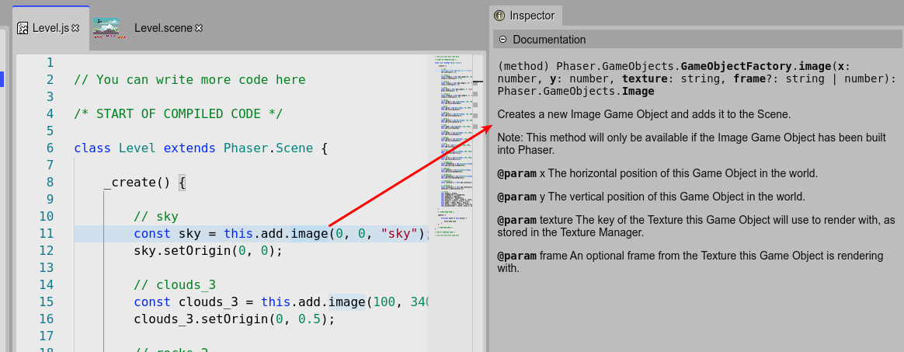
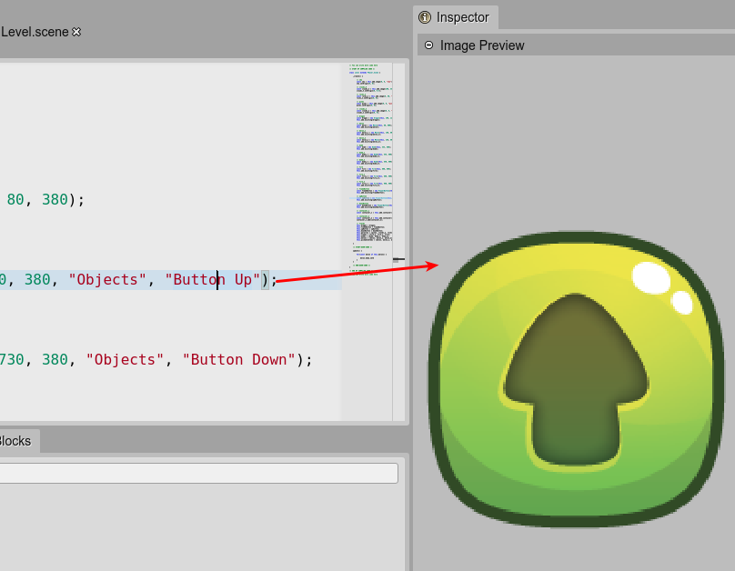

.. include:: ../_header.rst

Inspector view integration
``````````````````````````

If you enable the `advanced JavaScript editing features <js-editor-advanced-features.html>`_, the JavaScript editor will show in the |InspectorView|_ the documentation of the element selected in the editor:



If the selected element is a string literal, and its value is the same of a key in a |AssetPackFile|_, then the |InspectorView|_ will show a preview of the asset:

