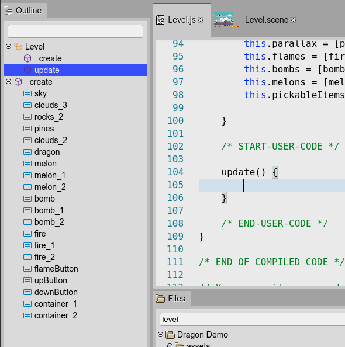

.. include:: ../_header.rst

Outline view integration
````````````````````````

If you enable the `advanced editing <js-editor-advanced-features.html>`_, the |OutlineView|_ shows the structure of the current JavaScript editor:


