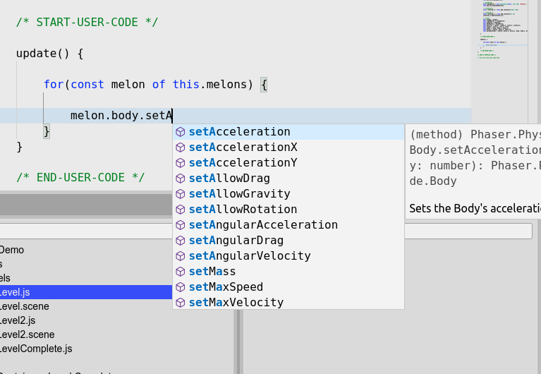

.. include:: ../_header.rst

JavaScript Editor
~~~~~~~~~~~~~~~~~

.. toctree::

    js-editor-advanced-features
    js-editor-outline-view
    js-editor-inspector-view
    js-editor-asset-pack-completions

The JavaScript editor included in |PhaserEditor|_ is based on the |MonacoEditor|_. The |MonacoEditor|_ is an advanced component that allows regular operations like code-completion, code hints, code browsing, etc...

