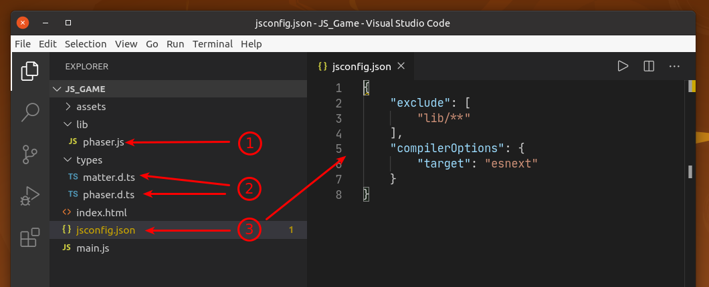

.. include:: ../_header.rst

Visual Studio Code compatibility
~~~~~~~~~~~~~~~~~~~~~~~~~~~~~~~~

The |vscode|_ editor is prefect for writing the code of the |PhaserEditor|_ games. First, t is extremely popular and powerful. Second, cause the projects created by |PhaserEditor|_ contains the files needed by |vscode|_ to provide a good coding experience with Phaser_.

Project structure
`````````````````

The JavaScript project templates include these files:



#. The file ``lib/phaser.js``. It is the Phaser_ runtime.

#. The Phaser_ type definition files: ``types/phaser.d.ts`` and ``types/matter.d.ts``. Those files are provided by Phaser_ and are used by the |vscode|_ to "understand" the |PhaserAPI|_.

#. The `project configuration <https://code.visualstudio.com/docs/languages/jsconfig>`_ file: ``jsconfig.json``.

 If it is a TypeScript project, then it includes the `tsconfig.json file <https://www.typescriptlang.org/docs/handbook/tsconfig-json.html>`_, instead of the ``jsconfig.json`` file.

Code Server
```````````

If you are using a remote instance of |PhaserEditor|_, you can try `Code Server <https://github.com/cdr/code-server/>`_. It allows to run VS Code in the same |PhaserEditor|_ server and edit the game code in your local browser.

Also, you can use cloud services like GitHub Codespace or Gitpod. In both cases you can install Phaser Editor 2D Core as a project dependency and run it alongside with VS Code.

Visual Studio Code & Phaser Editor 2D integration
`````````````````````````````````````````````````

|PhaserEditor|_ provides a few features for providing a better integration is |vscode|_:

* The **Open Visual Studio Code** command ``(Ctrl+Alt+U)`` opens the project's folder in |vscode|_.
* The **Open Output File in Visual Studio Code** ``(Ctrl+Alt+E)`` command is available in the context of a |SceneEditor|_, and opens the output scene's source file (JavaScript or TypeScript) in |vscode|_.
* The **Enable/Disable Open Code File In External Editor** commands enable or disable the external editor (Visual Studio Code by default) as the default option for opening code files (JavaScript, TypeScript, CSS, HTML).