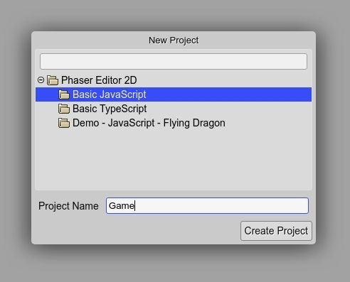
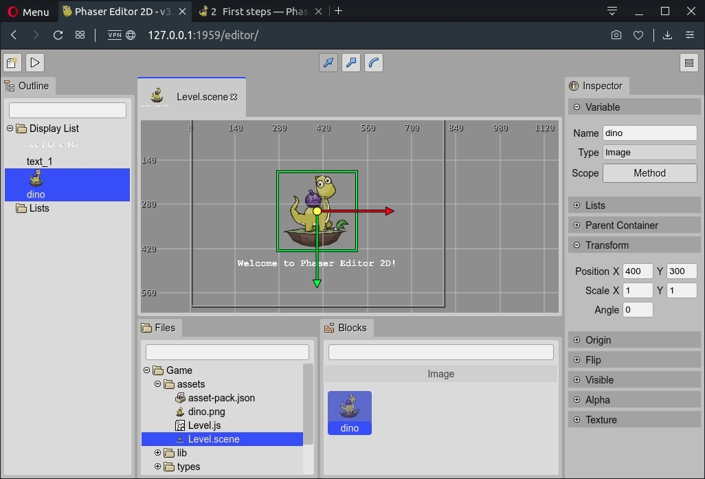
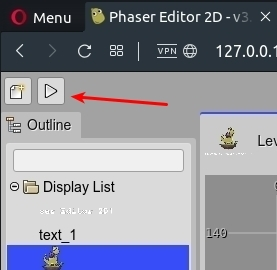

.. include:: ../_header.rst

Create your first project
-------------------------

The first time you open the IDE in the browser it shows the `New Project Dialog <../workbench/project-templates.html>`_. This dialog displays the project templates available in the server. Select one of the templates, write the name of the project and press the **Create Project** button:

The new project is created and shown in the workbench:

To run your project, click in the **Play** button at the beginning of the toolbar:

