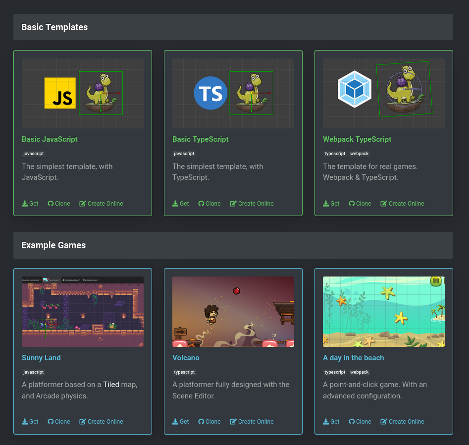
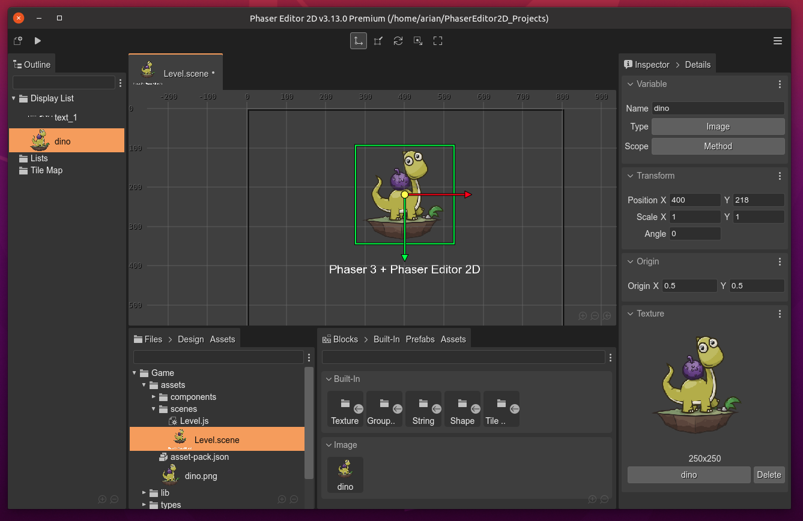
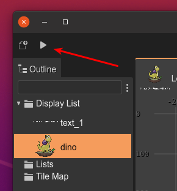

.. include:: ../_header.rst

Create your first project
-------------------------

We provide a couple of project templates that you can download from the `Phaser Editor 2D Start page <https://phasereditor2d.com/start>`_. You'll see that each template card contains links for downloading a zip with the project, a link to the GitHub project, and a link for opening the project in Gitpod_ (a cloud-based development environment).

|br|

There are two groups for templates: **Basic Templates** and **Example Games**.

The **Basic Templates** are "empty" projects with different setups. If you are making a professional game, we recommend using the **Webpack TypeScript** template.

You can take a look to the **Example Games** for learning Phaser Editor 2D by looking the code of "real games".

Each project template has a README file (in the GitHub repository) with the instructions for installing all required dependencies.

This method for stating a new project is great for the |core|_ distribution or for starting a new project in the cloud.

The |allInOne|_ distribution has the option of creating a new project. It contains the `Phaser Editor 2D Start page`_ templates, and it does not require Internet connection.

Follow these steps:

* Click on the **New Project** button:
  
  .. image:: ../images/first-steps-allInOne-new-project-1-20220415.webp
    :alt: All-in-one new project.
  
  |br|

* Select one of the project templates. Or click on the *Get more in the Marketplace* link, it shows more templates available in the the `Phaser Editor 2D Marketplace <https://marketplace.phasereditor2d.com>`_ (it requires an Internet connection):

  .. image:: ../images/first-steps-allInOne-new-project-2-20220415.webp
    :alt: Select project template

  |br|

* When you select a project template, the IDE opens the OS file explorer. Select a directory where the project content will be copied:

  .. image:: ../images/first-steps-select-project-template-20220415.webp
    :alt: Select the project folder.

|br|

The new project is created and shown in the workbench. If you get it from the marketplace, then it will get a time for fetching the files.

|br|

To run your project, click in the **Play** button at the beginning of the toolbar:

|br|
