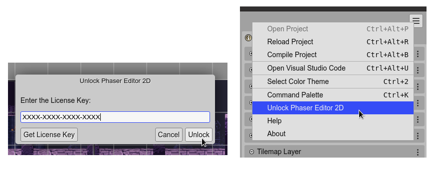

.. include:: ../_header.rst

Unlock the IDE
--------------

By default, the IDE runs in a Free mode. This mode includes all the IDE features, but limits the number of files per project to 70. If you need to create bigger projects, you have to unlock the IDE.

To unlock the IDE:

1. Purchase a license key in the `Phaser Editor 2D Gumroad page <https://gumroad.com/l/phasereditor/>`_. That key is valid for all the IDE versions. If you have a valid license key from a previous version (v1 or v2) then you don't need to purchase a new one.

2. Click on the **Unlock Phaser Editor 2D** option of the |MainMenu|_. It opens a dialog to enter the license key:

There previous option is only available when the editor is running in `application mode <./install-server.html#application-mode>`_, but you can open the terminal and write the command:

  .. code::

    $ PhaserEditor2D.exe -lickey <license key>

`Learn more about licenses and pricing <../pricing/index.html>`_