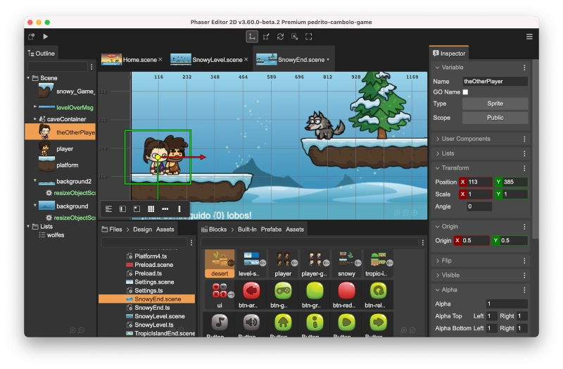

.. include:: _header.rst

Phaser Editor 2D Help
---------------------

Welcome to the Phaser Editor 2D v3 documentation!

.. |date| date::

Phaser Editor 2D is a powerful visual development tool for creating 2D games using the Phaser game engine. With its intuitive interface and extensive set of features, it allows developers of all skill levels to quickly and easily create high-quality games for desktop and mobile platforms. Whether you're a beginner or an experienced developer, Phaser Editor 2D provides everything you need to bring your game ideas to life.

Last update: |date|

.. toctree::
   :maxdepth: 2

   intro/index
   first-steps/index
   workbench/index
   asset-pack-editor/index
   scene-editor/index
   code-editor/index
   animations-editor/index
   atlas-editor/index
   misc/index
   pricing/index