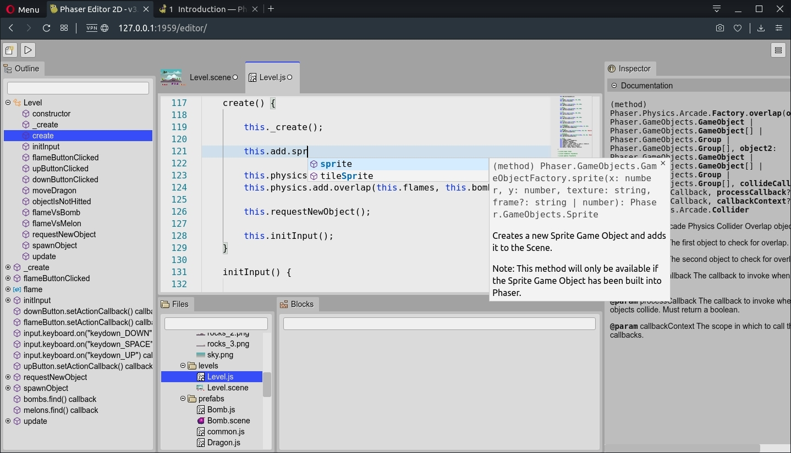
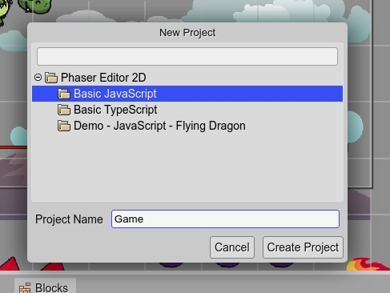
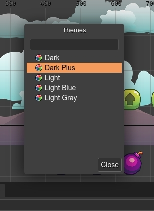

.. include:: _header.rst
   
.. highlight:: javascript

Introduction
============

|PhaserEditor|_ is an IDE to build 2D HTML5 games. The games are based on the popular and open source framework Phaser_ (version 3).

|PhaserEditor|_ v3 is the latest version of the IDE, and is a complete re-write in a new technology: the web.

Previous versions of the IDE was made on top of the |EclipseIDE|_ platform and included a lot of tools from this platform and other we developed. However, we changed our philosophy of bundle all kind of tools in the same product, and now the IDE is focused on design tools, especially, the |SceneEditor|_.

Author
------

|PhaserEditor|_ is developed by `Arian Fornaris <https://twitter.com/boniatillo_com>`_, an independent developer. New users often are confused because the IDE name, but |PhaserEditor|_ is not part and is not affiliated to the Phaser_ team. The Phaser_ team has its own development process and priorities.

However, Phaser_ is an open source project and its team is in constant contact with its community, accepting collaboration, releasing demos and tutorials, and sharing reports of the development progress.

Available for multiple platforms
--------------------------------

|PhaserEditor|_ v3, like the general of web applications, has two layers, the back-end (or server) and the front-end (or client).

At this moment, we have different back-end implementations, one for the desktop or private networks (for a single user), and other for the cloud, that allows multiple users.

The back-ends are closed (no source available to the public) and are commercial.

The front-end is the same for all back-ends. It is the most important and bigger part of the IDE. It is open source, has a MIT license and we welcome any collaboration on it. It is hosted on GitHub and is the main place to request features or report bugs.

`Phaser Editor 2D v3 project on GitHub <github.com/PhaserEditor2D/PhaserEditor2D-v3/>`_

Desktop and private networks back-end
~~~~~~~~~~~~~~~~~~~~~~~~~~~~~~~~~~~~~~

The back-end for desktop and private network is a small native program available for all the main platforms: Windows, macOS and Linux. It is the main product we offer to the community. You can download it from our website and run it in your desktop or your private server.

By the way, this back-end is especially friendly with remote containers and third-party tools like |vscode|_ . We should write an article about it.

`Download Phaser Editor 2D v3 <https://phasereditor2d.com/downloads>`_

Cloud back-end: Play Phaser Editor 2D
~~~~~~~~~~~~~~~~~~~~~~~~~~~~~~~~~~~~~

The back-end for the cloud is not available for download, it is hosted in our own cloud: |PlayPhaserEditor|_. It is a small service dedicated mainly to show the IDE features. It has two tiers: the **Premium** tier for Phaser Editor License owners and the **Free** tier for any registered user.

`Learn more about Play Phaser Editor 2D <https://play.phasereditor2d.com/about>`_

In the future, we should implement a more flexible service with a range of options to allow better management of the storage, the users and groups, the integration with third-party services, the game publishing and a marketplace for art assets and game components, between others.

Main features
-------------

The current version of |PhaserEditor|_ is pretty new. We released it with a few basic features.

Asset Pack Editor
~~~~~~~~~~~~~~~~~

The |AssetPackEditor|_ allows to import the asset files into an |AssetPackFile|_. This pack file is used by other components of the IDE, like the |SceneEditor|_ and is a built-in Phaser_ format. This means, that you can load it in any Phaser_ game, no matter if it was created by |PhaserEditor|_ or other tool.

Often, Phaser_ game developers have to write by hand the code to load the asset files. With the |AssetPackEditor|_ this process is fully visual and assisted.

`Learn more about the Asset Pack Editor <asset-pack-editor.html>`_

.. image:: images/asset-pack-editor-03312020.jpg
  :alt: Asset Pack Editor.

Scene Editor
~~~~~~~~~~~~

The |SceneEditor|_ is a visual tool to create Phaser_ scenes or levels by positioning images and other type of objects.

The images can be taken from different sources like single images, sprite-sheets or texture maps. You can create different type of objects like sprites, images, tile sprites, bitmap texts, texts, containers and lists. Also, you can create your own type of object using prefabs.

The |SceneEditor|_ uses a custom format, but the editor files are compiled into perfect readable Phaser_ code, compatible with any Phaser_ game and using only Phaser_ built-in API.

`Learn more about the Scene Editor <scene-editor.html>`_

.. image:: images/scene-editor-03312020.jpg
  :alt: Scene Editor.

Code Editor
~~~~~~~~~~~

An advanced coding tool is out of the scope of this version of the IDE. There are free and commercial third-party coding editors that works pretty well, with especial mention of |vscode|_.

|PhaserEditor|_ can be integrated very well with |vscode|_. The `project templates`_ include the |vscode|_ the configuration and type files required to get a project ready for |vscode|_.

However, many users may want to try the editor just as it is and quickly create prototypes of games. For those users, we included in the IDE a basic code tooling for JavaScript, TypeScript, HTML, CSS and JSON files. Thees tools are based on the |MonacoEditor|_, the one that is used by |vscode|_.

You can edit the code of your game and get nice features like auto-completion across multiple files, outline of the code, documentation of the language elements, and others.

`Learn more about the Code Editor <code-editor.html>`_

Project templates
~~~~~~~~~~~~~~~~~

Phaser_ is a framework and it does not require a particular layout for your projects. A Phaser_ game is just a web application, and there are lot of options to organize and build your game files.

|PhaserEditor|_ does not require any especial project layout neither, however, it provides a couple of project templates that help you to do an initial setup of your game. For example, it adds configuration files ready to be used by |vscode|_ and other files commonly used by the IDE, like an |AssetPackFile|_ or a first |SceneEditor|_ file.

Also, you can create projects based on demos, and learn Phaser_ and |PhaserEditor|_.

`Learn more about project templates <workbench.html#project-templates>`_

Color themes
~~~~~~~~~~~~

Since |PhaserEditor|_ is a web application, it is very easy to create color themes via CSS. The IDE includes a couple of themes and you can implement your own.

`Learn more about color themes <workbench.html#color-themes>`_

Extensible
~~~~~~~~~~

The IDE is built on top of Colibri_ (*hummingbird* in English), a small framework we did especially for |PhaserEditor|_. This framework is inspired by the Eclipse Rich Client Platform and allows to build desktop like applications (based on editors, views, commands, a remote storage, etc...) using modules and an extension mechanism, that is used to create new editors, commands, menus, color themes, game objects, etc...

We should write a Plugin Development Guide to target these concepts.

Lightweight and cross-platform
~~~~~~~~~~~~~~~~~~~~~~~~~~~~~~

As we mentioned in the `Available for multiple platforms`_ section, the IDE runs in the main Operating Systems: Windows, macOS and Linux.

The biggest part, the client application, should run in any modern browser (tested on Google Chrome, Firefox and Opera), and is served by a small (~9MB) native program, that is available for the mentioned platforms. The whole thing, client plus server, zip-compressed, is ~12MB of size.

The server just runs fast and has a pretty small memory footprint (~15MB).

The client application is accelerated by the browser and all the I/O operations are asynchronous. It feels lightweight in terms of operability, but it may push the browser to consume an extra 150MB/300MB of memory.

In the desktop it loads pretty fast. In a network, the fetching of all the resources may delay in dependence of your network speed, but are cached for the next run.

Collaboration
-------------

Your collaboration is welcome! You can collaborate by reporting issues, providing ideas, sending code modifications, writing tutorials. In anyway you think it could improve the product or helping the adoption of it.

The main place for collaboration is the |PhaserEditor|_ repository in GitHub:

`github.com/PhaserEditor2D/PhaserEditor2D-v3/ <github.com/PhaserEditor2D/PhaserEditor2D-v3/>`_

In addition, you can contact us in our social channels:

`Twitter @PhaserEditor2D <https://twitter.com/PhaserEditor2D>`_

`Facebook @PhaserEditor2D <https://facebook.com/PhaserEditor2D>`_

`Discord @PhaserEditor2D <https://discord.gg/4DdpMMD>`_

`YouTube <https://www.youtube.com/c/PhaserEditor2D>`_

Or just write an email to ``developer@phasereditor2d.com``.

Licensing and pricing
---------------------

|PhaserEditor|_ is a commercial product. You can use it by free in small games. For projects with a bigger number of files, you should `purchase a license key <https://gumroad.com/l/phasereditor/>`_ and unlock the IDE.

However, a huge part of the IDE is open source (MIT license) and you can modify it or use it in your own project.

`Learn more about licensing and pricing <pricing.html>`_
