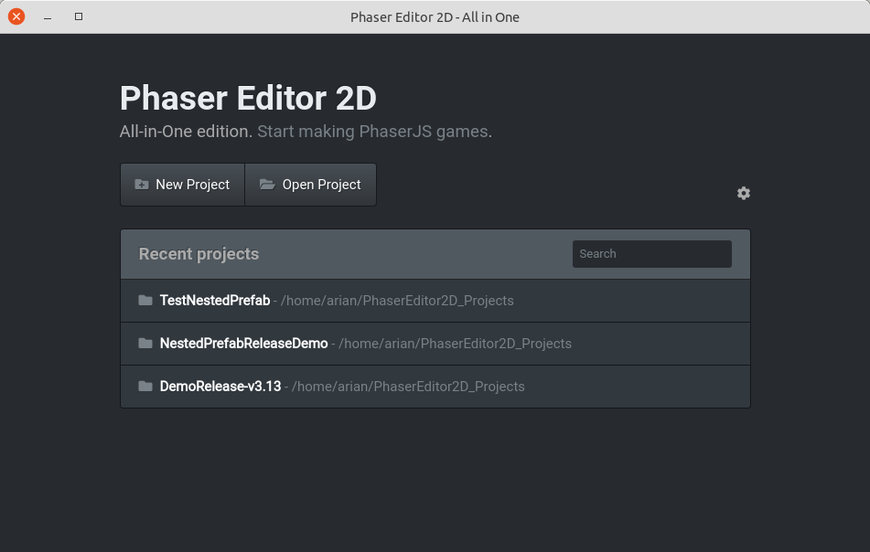
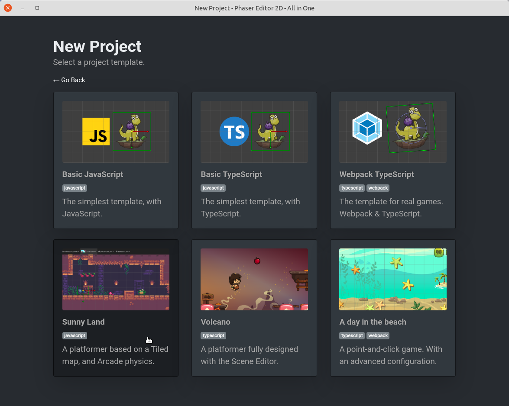

.. include:: ../_header.rst
   
.. highlight:: javascript

Phaser Editor 2D All-in-One
~~~~~~~~~~~~~~~~~~~~~~~~~~~

The |allInOne|_ distribution wraps the |core|_ distribution in an ElectronJS_ app, adding more features and integration with the Operating System.

This is the distribution we recommend to you if you are not familiar with the web development tooling (TypeScript, |npm|_, |webpack|_).

This distribution provides:

* A portable desktop application.
* A start page for opening & creating projects.
* A couple of project templates with different setups. Including some example games.
* It doesn't require a modern browser installed in your OS.
* It doesn't require an active Internet connection.

Start page, project list:

Start page, project templates:

