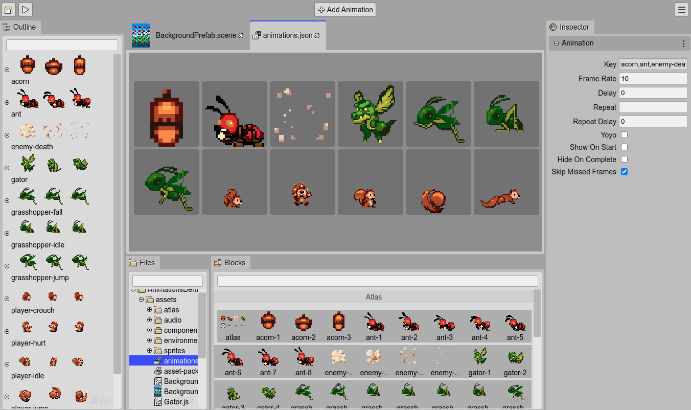

.. include:: ../_header.rst
   
.. highlight:: javascript

Main features
-------------

The current version of |PhaserEditor|_ is pretty new. We released it with a few basic features.

Asset Pack Editor
~~~~~~~~~~~~~~~~~

The |AssetPackEditor|_ allows you to import the asset files into an |AssetPackFile|_. This pack file is used by other components of the IDE, like the |SceneEditor|_ and is a built-in Phaser_ format. This means, that you can load it in any Phaser_ game, no matter if it was created by |PhaserEditor|_ or another tool.

Often, Phaser_ game developers have to write by hand the code to load the asset files. With the |AssetPackEditor|_ this process is fully visual and assisted.

`Learn more about the Asset Pack Editor <../asset-pack-editor/index.html>`_

.. image:: ../ images/asset-pack-editor-overview-04072020.webp
  :alt: Asset Pack Editor.

Scene Editor
~~~~~~~~~~~~

The |SceneEditor|_ is a visual tool to create Phaser_ scenes or levels by positioning images and other types of objects.

The images can be taken from different sources like single images, sprite-sheets, or texture maps. You can create a different type of objects like sprites, images, tile sprites, bitmap texts, texts, containers, and lists. Also, you can create your custom type of object using prefabs_ and create reusable |UserComponents|_.

The |SceneEditor|_ uses a custom format, but the editor files are compiled into perfect readable Phaser_ code, compatible with any Phaser_ game, and using only Phaser_ built-in API.

`Learn more about the Scene Editor <../scene-editor/index.html>`_

.. image:: ../ images/scene-editor-04102020.webp
  :alt: Scene Editor.

Animations Editor
~~~~~~~~~~~~~~~~~

The |AnimationsEditor|_ helps to create sprite-based animations. It creates a JSON file that can be loaded into the game using the `Phaser Loader API <https://photonstorm.github.io/phaser3-docs/Phaser.Loader.LoaderPlugin#__animation>`_ or using the |AssetPackEditor|_.

A handy tool provided by the |AnimationsEditor|_ is the `automatic creation of the animations <../animations-editor/auto-build-animations.html>`_.

Code Editor
~~~~~~~~~~~

An advanced coding tool is out of the scope of this version of the IDE. There are free and commercial third-party coding editors that work pretty well, with special mention of |vscode|_.

|PhaserEditor|_ can be integrated very well with |vscode|_. The `project templates  <../workbench/projects.html#project-templates>`_ include the |vscode|_ the configuration and type files required to get a project ready for |vscode|_.

However, many users may want to try the editor just as it is and quickly create prototypes of games. For those users, we included in the IDE a basic code tooling for JavaScript, TypeScript, HTML, CSS, and JSON files. These tools are based on the |MonacoEditor|_, the one that is used by |vscode|_.

You can edit the code of your game and get nice features like auto-completion across multiple files, an outline of the code, documentation of the language elements, and others.

`Learn more about the Code Editor <../code-editor/index.html>`_

.. image:: ../ images/code-editor-03312020.jpg
  :alt: JavaScript Editor.

Project templates
~~~~~~~~~~~~~~~~~

Phaser_ is a framework and it does not require a particular layout for your projects. A Phaser_ game is just a web application, and there are a lot of options to organize and build your game files.

|PhaserEditor|_ does not require any special project layout neither, however, it provides a couple of project templates that help you to do an initial setup of your game. For example, it adds configuration files ready to be used by |vscode|_ and other files commonly used by the IDE, like an |AssetPackFile|_ or a first |SceneEditor|_ file.

Also, you can create projects based on demos, and learn Phaser_ and |PhaserEditor|_.

`Learn more about project templates <../workbench/projects.html#project-templates>`_

.. image:: ../ images/project-templates-03312020.jpg
  :alt: Project templates.

Color themes
~~~~~~~~~~~~

Since |PhaserEditor|_ is a web application, it is very easy to create color themes via CSS. The IDE includes a couple of themes and you can implement your own.

`Learn more about color themes <../workbench/color-themes.html>`_

.. image:: ../ images/color-themes-03312020.jpg
  :alt: Color themes

Extensible
~~~~~~~~~~

The IDE is built on top of Colibri_ (*hummingbird* in English), a small framework we did especially for |PhaserEditor|_. This framework is inspired by the Eclipse Rich Client Platform and allows to build desktop-like applications (based on editors, views, commands, remote storage, etc...) using modules and an extension mechanism, that is used to create new editors, commands, menus, color themes, game objects, etc...

We should write a Plugin Development Guide to target these concepts.

Lightweight and cross-platform
~~~~~~~~~~~~~~~~~~~~~~~~~~~~~~

The IDE is available in the main Operating Systems: Windows, macOS, and Linux.

The big part (the client application) should run in any modern browser (tested on Google Chrome, Firefox, and Opera), and is served by a small native program, available for the mentioned platforms. 

The client application is accelerated by the browser and all the I/O operations are asynchronous. It feels lightweight in terms of operability, but it may push the browser to consume an extra 150MB/300MB of memory. It depends the amount of images present in the project.

On the desktop, it loads pretty fast. In a network, the fetching of all the resources may delay, it depends on your network speed.

Ready for the desktop and the cloud
~~~~~~~~~~~~~~~~~~~~~~~~~~~~~~~~~~~

The editor is distributed as two different products, the |core|_ and the |allInOne|_.

The |core|_ can be integrated into a modern web development stack and cloud-based development environments (like Gitpod_ and |GithubCodespaces|_).

The |allInOne|_ is a desktop application that provides a traditional IDE-like experience.