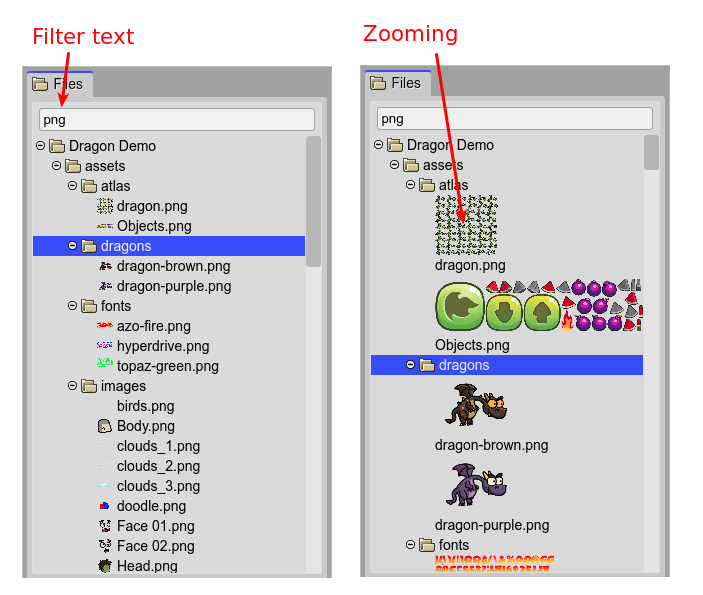
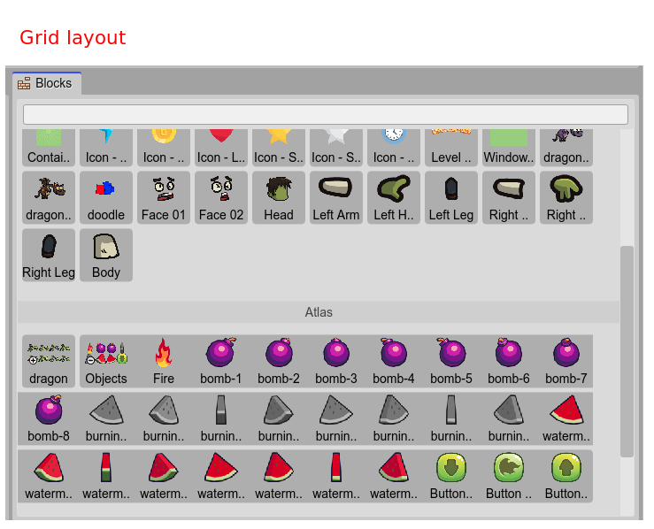

.. include:: ../_header.rst

Content viewers
---------------

Viewers are elements to show structured data. In the major of the cases, these elements have a text and an icon. The icon could be a regular icon or a thumbnail image, an in-line preview of the element. It is the case of image files, scene files, asset pack elements like atlas and sprite-sheets.

All viewers share a common set of features:

* You can zoom in/out the images. Press the ``Ctrl`` key and roll the mouse wheel.

* The viewer can have a tree layout ot a grid layout. In the case of the grid layout, if you zoom out enough, it will switch to the tree layout.

* You can filter the content of the viewer, displaying only the items with a label that matches the text in the search box. If you clean the search box, all items are shown.

* Both, the grid and tree layout, allow collapsing/expanding the items. With the ``Space`` key you collapse/expand the selected item. With the ``C`` key you can collapse all the items.

