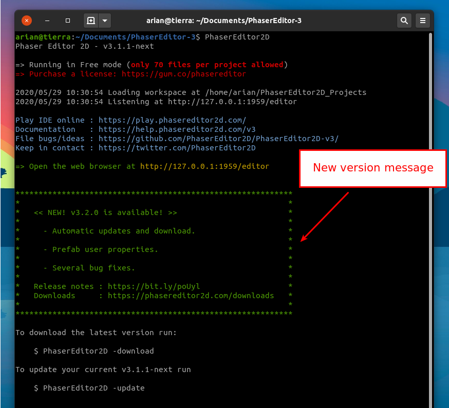

.. include:: ../_header.rst

Automatic update
----------------

When you start the server, it connects with the updates site in Internet and checks if there is a new version. If there is a new version then it shows a message with the version number and some headlines of the release notes.

If you wish to update the editor to the latest version (something that we recommend to do), press ``Ctrl+C`` to stop the server and execute:

.. highlight:: bash

.. code::
    
    $ PhaserEditor2D -update

Then the server downloads the latest version and installs it. The old files will be replaced with the new files. If you have custom templates or plugins you should backup them in other place.

Also you have the option of download the latest version:

.. code::

    $ PhaserEditor2D -download

It downloads the same ZIP file that is available in the Phaser Editor 2D website. You can unzip it in other folder and execute the new version.

