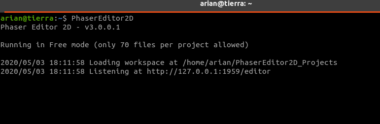

.. include:: ../_header.rst

Free mode
~~~~~~~~~

The Free mode of the IDE contains all the features, but you can store only ``70`` files in a single project.

The files and folder that start with a dot (``.``) are ignored. For example, the database files of a Git repository (inside a ``.git`` folder) do not affect the number of files allowed in the project.

When you run the server and it is not un-locked, it runs in Free mode:

