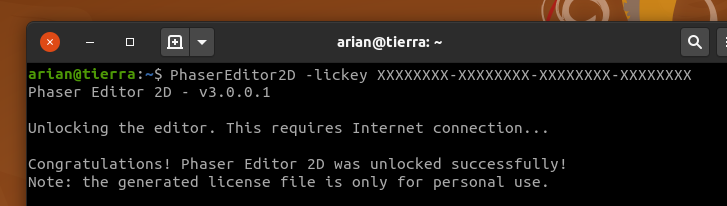
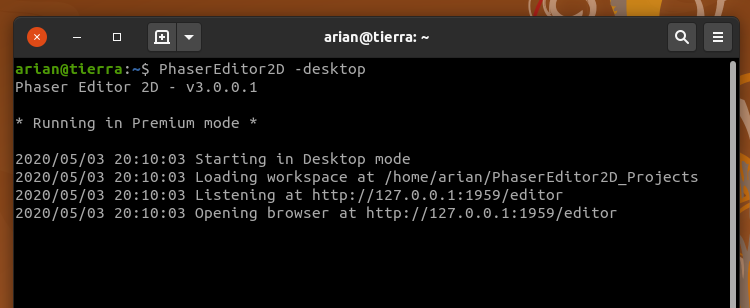

.. include:: ../_header.rst

Premium mode
~~~~~~~~~~~~

With the Premium mode you can use the IDE without any limitation.

To un-lock this mode you need to purchase a license key in the `Phaser Editor 2D Gumroad's page <gumroad.com/l/phasereditor/>`_.

The license key is sent to your mail. Copy the key and un-lock the IDE with the ``lickey`` option:

The activation of the IDE verifies the key (it requires an Internet connection) and generates a license file (``PhaserEditor2D.lic``) in the same installation folder. It is a portable file, you can use it in any installation of the editor. But attention, don't share that file with other developers, it is personal.

If the IDE is unlocked, it shows a welcome message when you run the server:

Every license key has an expiration date. You can purchase a license key for one year, for two years or for lifetime. 
