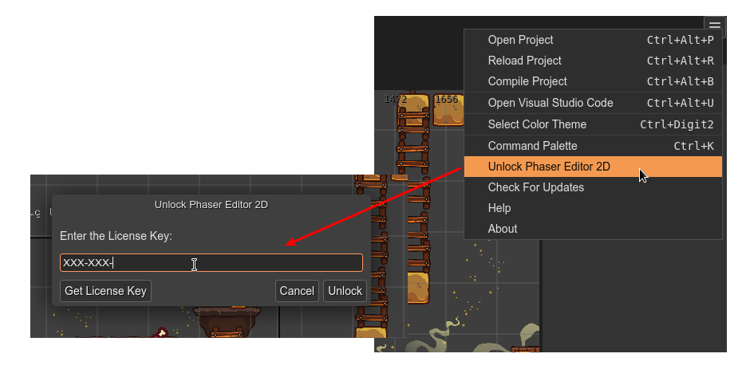
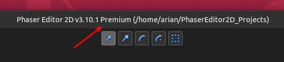

.. include:: ../_header.rst

Premium mode
~~~~~~~~~~~~

With the Premium mode, you can use the IDE without any limitation.

To unlock this mode you need to purchase a license key in the `Phaser Editor 2D Gumroad's page <https://gumroad.com/l/phasereditor/>`_.

The license key is sent to your email. Copy the key and un-lock the IDE with the **Unlock Phaser Editor 2D** option in the |MainMenu|_:

The activation of the IDE verifies the key (it requires an Internet connection) and generates a license file in the user home folder (``$HOME/.phasereditor2d/PhaserEditor2D.lic``). It is a portable file, you can use it in any installation of the editor. But attention, don't share that file with other developers, it is personal.

Also, you can un-lock the editor using ``-lickey`` option in the command line:

.. image:: ../images/lic-premium-mode-05032020.webp
    :alt: Unlock the editor.

If the IDE is unlocked, it shows the **Premium** suffix in the title bar of the editor:

