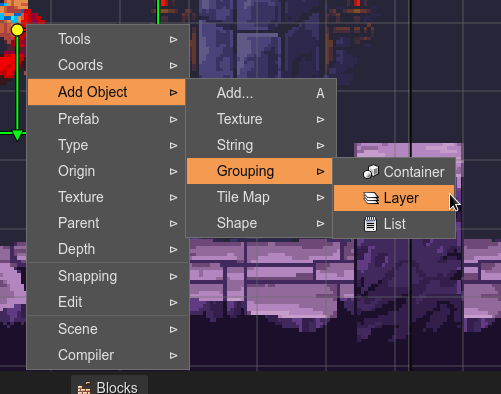
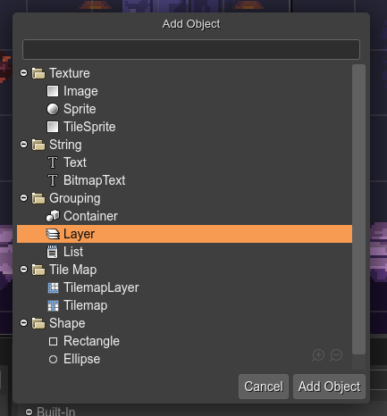

.. include:: ../_header.rst

Add built-in object from context menu
~~~~~~~~~~~~~~~~~~~~~~~~~~~~~~~~~~~~~

The Scene Editor's context menu shows different options for creating a new built-in object.

The **Add Object** sub-menu shows all categories of the built-in object types:

Also, the **Add...** (``A``) option opens a dialog with all the built-in types. That's great for quickly adding a new object:

