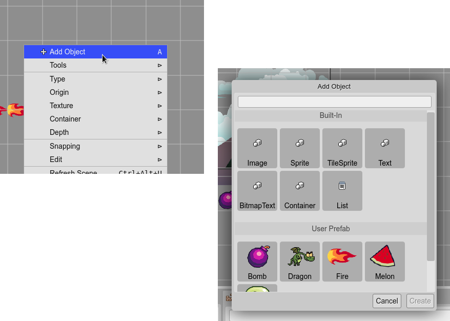

.. include:: ../_header.rst

The Add Object dialog
~~~~~~~~~~~~~~~~~~~~~

The **Add Object** dialog displays all the type of objects you can create in the |SceneEditor|_.

You can open it by pressing the ``A`` key or the **Add Object** option of the scene context menu.

The dialog shows two group of types: **Built-In** and **User Prefab**.

The built-in types are the game object types provided by Phaser_ (like the `Image <image-object.html>`_), and are the base types to create the objects of scene. The **User Prefab** group lists the reusable types created by the user: `the prefabs <prefabs.html>`_.

Select one of the types and press the **Create** button. If you select a built-in type, an instance is created with default values, in the center of the screen. The objects like the `sprites <sprite-object.html>`_ or `images <image-object.html>`_ are created without a texture. You can add a texture to an object in the `Texture section <image.html#texture-section>`_ of the `Inspector view <inspector-view-integration.html>`_.

If you select a `prefab type <prefabs.html>`_, then an instance of the prefab_ is created with the default values, in the center of the screen.

