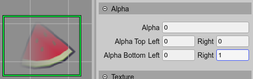

.. include:: ../_header.rst

Alpha properties
----------------

These properties allow setting transparency to the objects.

The `alpha <https://photonstorm.github.io/phaser3-docs/Phaser.GameObjects.Components.Alpha.html#alpha__anchor>`_ property sets global transparency to the object. The ``alphaTopLeft``, ``alphaTopRight``, ``alphaBottomLeft`` and ``alphaBottomRight`` properties of the `Alpha component <https://photonstorm.github.io/phaser3-docs/Phaser.GameObjects.Components.Alpha.html>`_ add interpolated transparency to the corners of the object.

