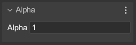

.. include:: ../_header.rst

Alpha single property
---------------------

The `alpha <https://photonstorm.github.io/phaser3-docs/Phaser.GameObjects.Components.AlphaSingle.html#alpha__anchor>`_ property sets global transparency to the object.

