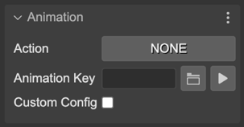
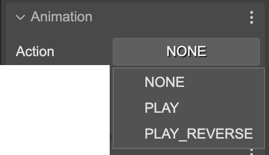
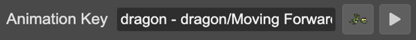
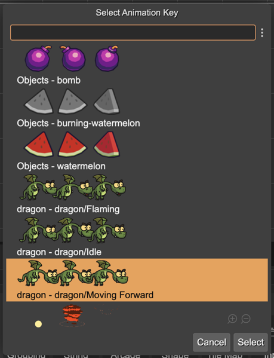
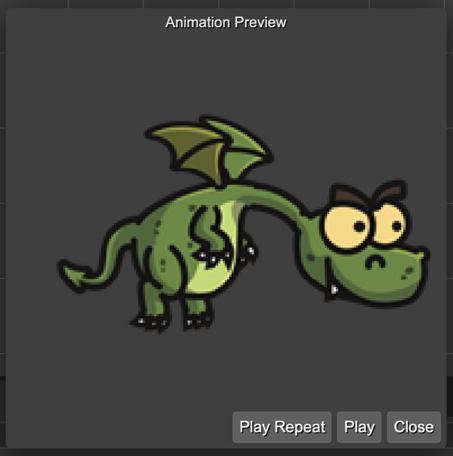
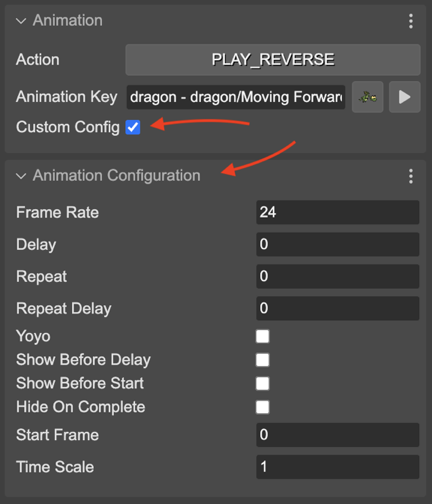

.. include:: ../_header.rst

Animation properties
--------------------

The animation properties section contains the parameters of the `play() <https://photonstorm.github.io/phaser3-docs/Phaser.GameObjects.Sprite.html#play__anchor>`_ method of the `Sprite <sprite-object.html>`_ game object:

The **Action** parameter indicates what method execute to play the animation:

* **NONE** (default): Doesn't call any method, doesn't play any animation.
* **PLAY**: Calls the `play()`_ method.
* **PLAY_REVERSE**: Calls the `playReverse() <https://photonstorm.github.io/phaser3-docs/Phaser.GameObjects.Sprite.html#playReverse__anchor>`_ method.

The **Animation Key** parameter contains the key of the animation to play:

  
Next to the key name, there are two buttons. A button for opening an animation key selection dialog and a button for previewing the selected animation.

The animation key selection dialog:

The animation preview dialog:

This dialog searches for animations defined in a `Phaser animations file <../animations-editor/>`_ or in the Aseprite_ assets included in an |AssetPackFile|_.

This is the code the |SceneCompiler|_ generates for playing the animation:

.. code:: 

    dragon.play("dragon - dragon/Moving Forward");

Or, if you select the **PLAY_REVERSE** action:

.. code:: 

    dragon.playReverse("dragon - dragon/Moving Forward");

When you define the animations in the |AnimationsEditor|_ or in Aseprite_, you configure parameters like repetitions, duration, direction, etc... However, in the scene, you can pass a custom configuration to the `play()`_ method. To do this in the |SceneEditor|_ you have to check the **Custom Config** parameter.

If the **Custom Config** parameter is selected, then it shows the **Animation Configuration** section. It shows all the parameters you can set to an animation:

When you set the custom configuration, the |SceneCompiler|_ generates this code:

.. code:: 

    dragon.play({
        "key": "dragon - dragon/Moving Forward"
        "frameRate": 10,
        "repeat": -1
    });