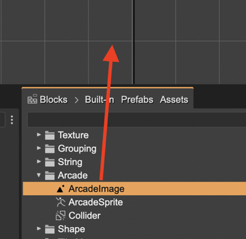
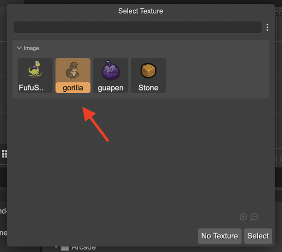
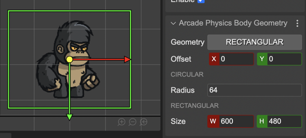

.. include:: ../_header.rst

Creating Arcade Image and Sprite objects
~~~~~~~~~~~~~~~~~~~~~~~~~~~~~~~~~~~~~~~~

The simplest way of creating an object with an Arcade physics body is by adding a `Phaser.Physics.Arcade.Image <https://newdocs.phaser.io/docs/3.55.2/Phaser.Physics.Arcade.Image>`_ or `Phaser.Physics.Arcade.Sprite <https://newdocs.phaser.io/docs/3.55.2/Phaser.Physics.Arcade.Sprite>`_ object to the scene. Both types are available in the Arcade section of the |BlocksView|_:

When you drop it to the scene, it shows a dialog for selecting a texture:

Arcade game objects are generated in code with the `image <https://newdocs.phaser.io/docs/3.54.0/Phaser.Physics.Arcade.Factory#image>`_ and `sprite <https://newdocs.phaser.io/docs/3.54.0/Phaser.Physics.Arcade.Factory#sprite>`_ factories of the Arcade physics system:

.. code::
    
    // gorilla
    const gorilla = this.physics.add.image(310, 313, "gorilla");
    gorilla.body.setOffset(216, 58);
    gorilla.body.setSize(186, 365, false);

The **Arcade Image** and **Arcade Sprite** game object types provide helper methods for configuring the physics body. However, you can `enable an Arcade physics body in any other game object <arcade-physics-add-body.html>`_.