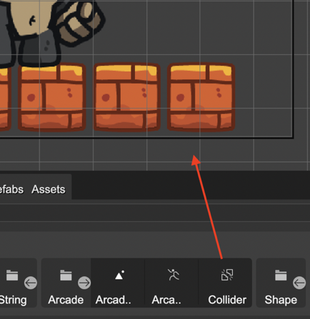
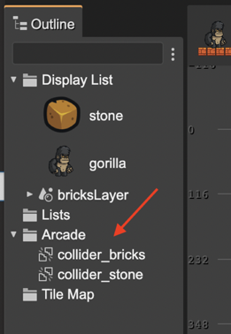
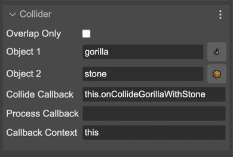
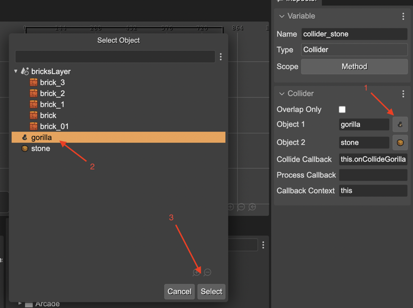

.. include:: ../_header.rst

Arcade physics collider
~~~~~~~~~~~~~~~~~~~~~~~

A `Collider <https://newdocs.phaser.io/docs/3.55.2/Phaser.Physics.Arcade.Collider>`_ is an object for checking collisions between multiple physics objects. The |SceneEditor|_ allows creating a collider by dragging it from the |BlocksView|_ to the scene:

The collider objects are shown in the **Arcade** section of the |OutlineView|_:

When you select it, it shows the collider properties in the |InspectorView|_. Each parameter corresponds to a parameter in the `Collider <https://newdocs.phaser.io/docs/3.55.2/Phaser.Physics.Arcade.Collider>`_ constructor:

The properties are:

* `overlapOnly <https://newdocs.phaser.io/docs/3.55.2/Phaser.Physics.Arcade.Collider#overlapOnly>`_
* `object1 <https://newdocs.phaser.io/docs/3.55.2/Phaser.Physics.Arcade.Collider#onject1>`_
* `object2 <https://newdocs.phaser.io/docs/3.55.2/Phaser.Physics.Arcade.Collider#object2>`_
* `collideCallback <https://newdocs.phaser.io/docs/3.55.2/Phaser.Physics.Arcade.Collider#collideCallback>`_
* `processCallback <https://newdocs.phaser.io/docs/3.55.2/Phaser.Physics.Arcade.Collider#processCallback>`_
* `callbackContext <https://newdocs.phaser.io/docs/3.55.2/Phaser.Physics.Arcade.Collider#callbackContext>`_

The |SceneCompiler|_ verbatim-compies the values of the parameters (excepting **overlapOnly**) into the code. So you can write any JavaScript valid expression as value for the parameter.

In the case of the **Object 1** and **Object 2** parameters, you have the option of selecting the variable name of an object of the scene:

In addition to objects, you can reference an `Object List <./object-list.html>`_.

So, the collider object is generated in code using the `collider <https://newdocs.phaser.io/docs/3.54.0/Phaser.Physics.Arcade.Factory#collider>`_ or `overlap <https://newdocs.phaser.io/docs/3.54.0/Phaser.Physics.Arcade.Factory#overlap>`_ methods of the Arcade `Factory <https://newdocs.phaser.io/docs/3.54.0/Phaser.Physics.Arcade.Factory>`_ class. Something like this:

.. code::

 const collider_stone = this.physics.add.collider(gorilla, stone, this.onCollideGorillaWithStone, undefined, this);

Or, if the **Overlap Only** parameter is selected:

.. code::

 const collider_stone = this.physics.add.overlap(gorilla, stone, this.onCollideGorillaWithStone, undefined, this);

In addition to the Collider properties, it contains the `Variable properties <./variable-properties.html>`_.