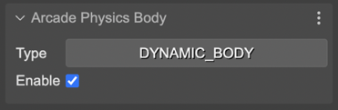
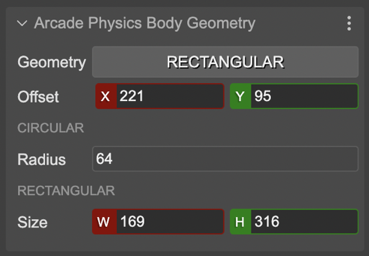
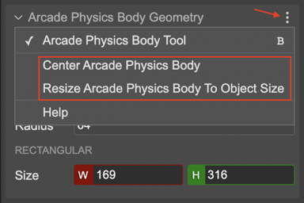

.. include:: ../_header.rst

Arcade physics body properties
~~~~~~~~~~~~~~~~~~~~~~~~~~~~~~

.. contents::

When you select an object, the |InspectorView|_ shows the editors for editing the Arcade body of the object.

The properties are grouped by sections:

Arcade Physics Body section
```````````````````````````

It allows changing the type of body to `dynamic <https://newdocs.phaser.io/docs/3.55.2/Phaser.Physics.Arcade.Body>`_ or `static <https://newdocs.phaser.io/docs/3.55.2/Phaser.Physics.Arcade.StaticBody>`_. And set the `enable flag <https://newdocs.phaser.io/docs/3.55.2/Phaser.Physics.Arcade.Body#enable>`_:



Arcade Physics Body Geometry section
````````````````````````````````````

This section contains the properties for setting the offset & size of the body. You can select the body's shape in the **Geometry** parameter. If the body is rectangular, you can change its `Size <https://newdocs.phaser.io/docs/3.55.2/Phaser.Physics.Arcade.Body#setSize>`_. If the body is circular, you can change its `Radius <https://newdocs.phaser.io/docs/3.55.2/Phaser.Physics.Arcade.Body#setCircle>`_. In both cases, you can change the `Offset <https://newdocs.phaser.io/docs/3.55.2/Phaser.Physics.Arcade.Body#setOffset>`_.



Another way of changing the body's offset and size is activating the `Arcade Physics Body Tool <./manipulation-tools.html#arcade-physics-body-tool.html>`_.

Also, in the scene context menu, in the **Arcade Physics**, there are the options **Center Body** and **Resize Body To Object Size**. Those commands are also available in the three-dots menu of the properties section:



The **Center Arcade Body** commands places the body at the center of the object. The **Resize Body To Object Size** command centers the body and resizes it to fill the whole object. If the body is circular, it changes the radius to fill the object's width.
