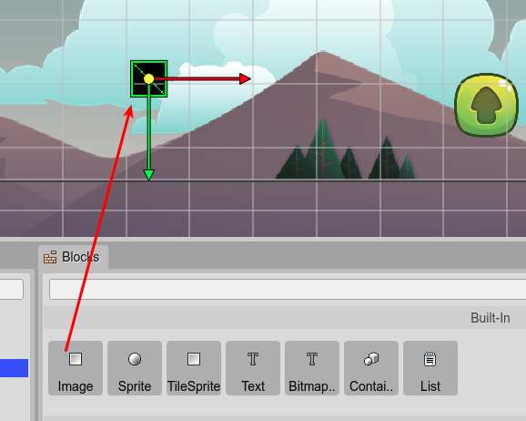
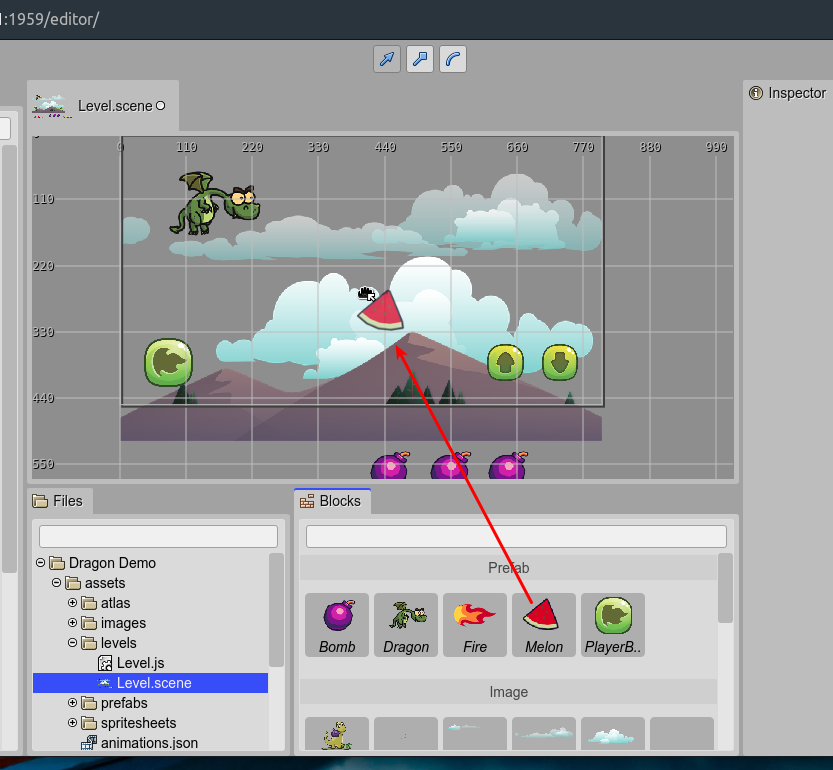

.. include:: ../_header.rst

Blocks view integration
~~~~~~~~~~~~~~~~~~~~~~~

When the |SceneEditor|_ is active, the |BlocksView| shows the "blocks" you can get and drop into the scene, to create new objects. These are the blocks:

* Built-in types. Phaser_ types and other |PhaserEditor|_ related types.
* Images packed in an |AssetPackFile|_.
* The frames of a sprite-sheet or texture map defined in an |AssetPackFile|_.
* `Bitmap Fonts <bitmap-text-object.html>`_ packed in an |AssetPackFile|_.
* The prefabs_ you created.

The first items shown in the |BlocksView|_ are the primitive object types supported by the |SceneEditor|_. You can drag on type on drop it into the scene to create an instance of the type, with the default values.

In case of images, sprites or tile-sprites, the new instance does not contain a texture. If you want to set a texture to the object, you can select one in the `Texture section <texture-property.html>`_.

However, if you drop an image or texture frame into the scene, the editor creates a new `Image object <image-object.html>`_ and sets the dropped texture as the object's texture.

Maybe, instead of an `Image <image-object.html>`_, you need to create a `TileSprite <tile-sprite-object.html>`_ with the same texture, in that case, you can just `convert it to a TileSprite <replace-object-type.html>`_.

If you drop a **BitmapFont**, the editor creates a `Bitmap Text <bitmap-text-object.html>`_.

If you drop a Prefab_, the editor creates an instance of it.

