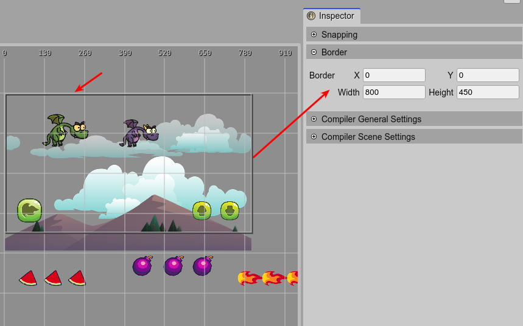

.. include:: ../_header.rst

Border properties
~~~~~~~~~~~~~~~~~

The |SceneEditor|_ shows a frame, or border, that you can use as reference of the game size, a prefab_ size, or whatever you need to frame.

It is not part of the |PhaserAPI|_, it is just an editor resource and does not affect the game in any way.

You can change the border values in the |InspectorView|_. It has a position and a size.

