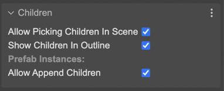

.. include:: ../_header.rst

Children properties
-------------------

The `containers <./container-object.html>`_ and `layers <./layer-object.html>`_ are objects with children, and share children-based properties.

The **Children** properties are not part of the Phaser_ API, they are used only by the editor, in design-time.

The **Allow Picking Children In Scene** property allows picking a child in the scene. If it is disable, you cannot pick a child by clicking in the scene. This is useful if you want to manipulate the parent container (or layer) and children as a single object.

The **Show Children In Outline** parameter is similar. It allows showing the container or layer children in the |OutlineView|_.

The **Allow Append Children** parameter indicates this Layer or Container allows adding new children in prefab instances. This parameter has sense only if the object has a nested prefab scope. `Learn more about adding children to a prefab instance <./prefab-instance-children.html>`_.