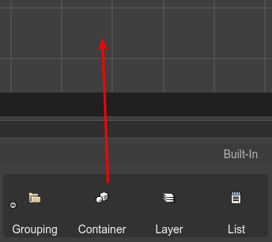

.. include:: ../_header.rst

Container objects
-----------------

In Phaser_ 3, the only game object types that have children are the Container (`Phaser.GameObjects.Container <https://photonstorm.github.io/phaser3-docs/Phaser.GameObjects.Container.html>`_) and the `Layer <./layer-object.html>`_ objects. But only the Container can be used to transform the children (in position, angle and scale).

`Learn more about working with parent objects in the Scene Editor <./working-with-parent-objects.html>`_.

You can create a `container <container-object.html>`_ by dropping a `Container built-in block <blocks-view-integration.html>`_ on the scene,  or with the `Create Container with Selection <#grouping-objects-in-a-container>`_ command.

The code generated by the |SceneCompiler|_, to create a `container`_, is like this:

.. code::

    // x=100, y=20
    const container_1 = this.add.container(100, 20);

    // some object is created and added to the container
    const someObject = ... ;
    container_1.add(someObject);

Grouping objects in a Container
~~~~~~~~~~~~~~~~~~~~~~~~~~~~~~~

There are cases where you need to create a container with a couple of objects. You can do this by selecting the objects and executing the  `Create Container with Selection`_ command.

To execute the command, you can press the ``J`` key or select it the `context menu <./working-with-parent-objects.html#the-parent-context-menu>`_.

#. Select the objects.

#. Execute the command (press ``J``).

#. A new container is created.

#. The objects are removed from the original parent.

#. The objects are added to the new container.

#. The new container is `trimmed <#trimming-a-container>`_.

.. image:: ../images/scene-editor-create-container-with-selection-04182020.webp
    :alt: Create container with selection.

Trimming a Container
~~~~~~~~~~~~~~~~~~~~

The **Trim Container** command removes the whitespace of the container. This means, that the children are shifted to the left/top corner to the container, and the container is re-positioned to keep the children at the same global position.

To execute this command press the ``Shift+T`` key or select the **Trim Container** options of the `context menu`_.

.. image:: ../images/scene-editor-trim-container-04182020.webp
    :alt: Trim container.

Container properties
~~~~~~~~~~~~~~~~~~~~

The `Container`_ type contains some of the `common object properties <common-object-properties.html>`_:

* `Variable properties <variable-properties.html>`_

* `Lists properties <lists-properties.html>`_

* `Children properties <children-properties.html>`_

* `Transform properties <transform-properties.html>`_

* `Visible property <visible-property.html>`_
