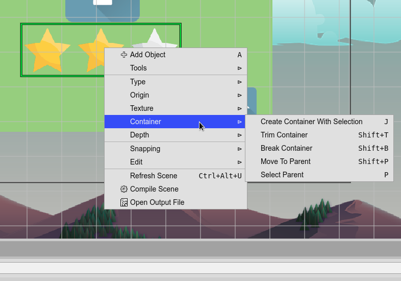
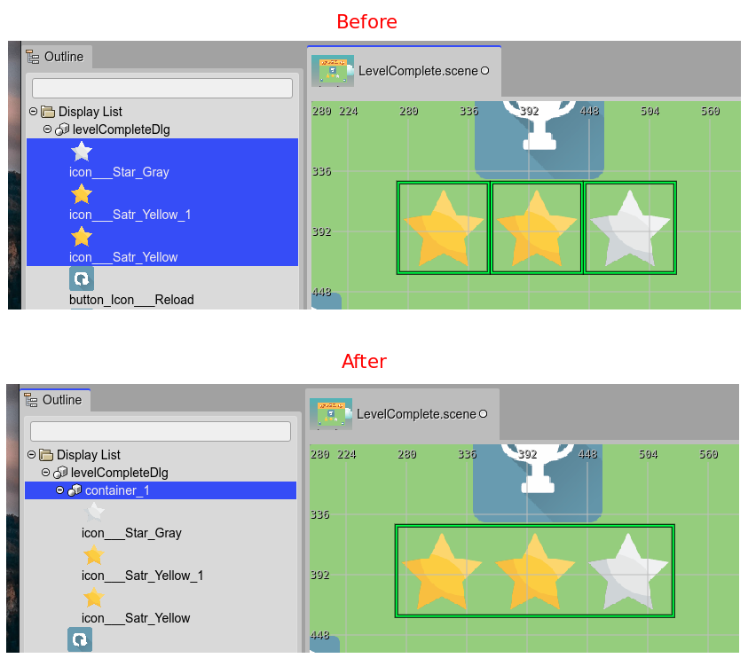
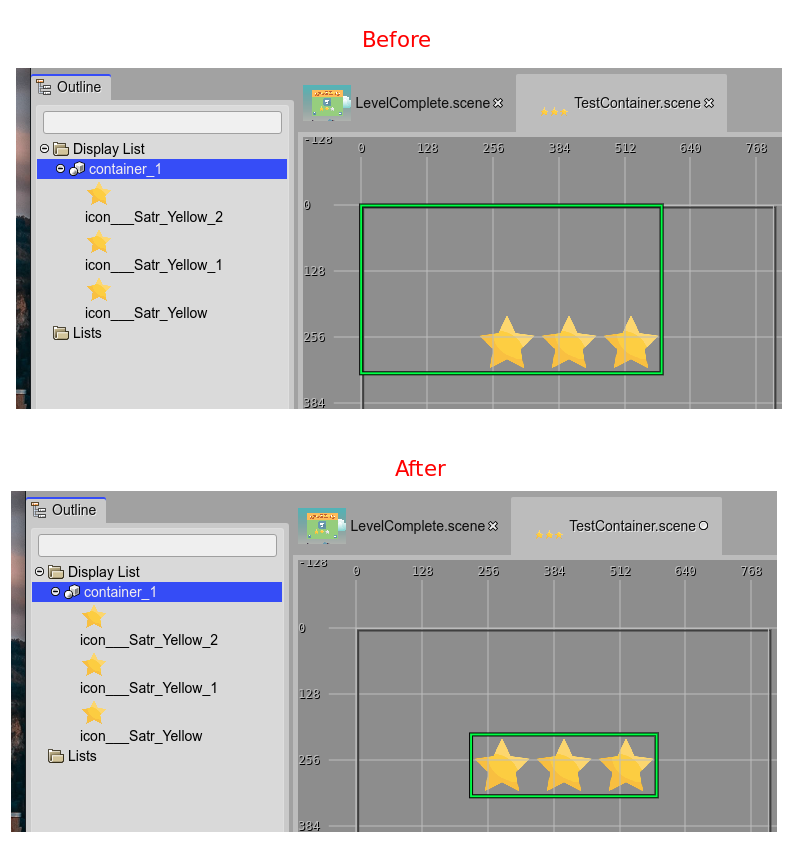
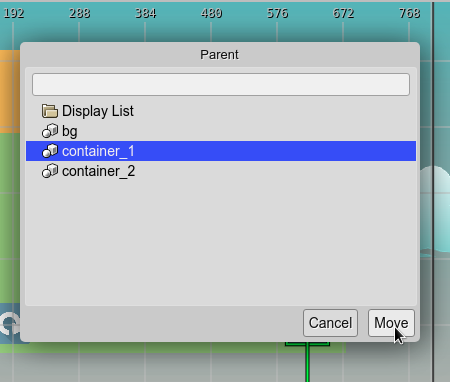

.. include:: ../_header.rst

Container objects
-----------------

In Phaser_ 3, the only game object type that has children is the container (`Phaser.GameObjects.Container <https://photonstorm.github.io/phaser3-docs/Phaser.GameObjects.Container.html>`_). This is the reason why the `container type <container-object.html>`_ is so important.

You can create a `container <container-object.html>`_ with the `Add Object dialog <add-object-dialog.html>`_ or with the `Create Container with Selection <#grouping-objects-in-a-container>`_ command.

The code generated by the |SceneCompiler|_, to create a `container`_, is like this:

.. code::

    // x=100, y=20
    const container_1 = this.add.container(100, 20);

    // some object is created and added to the container
    const someObject = ... ;
    container_1.add(someObject);

The Container context menu options
~~~~~~~~~~~~~~~~~~~~~~~~~~~~~~~~~~

The `context menu <container-object.html#the-container-context-menu-options>`_  has a **Container** section with a couple of commands related to the `container`_.

Grouping objects in a Container
~~~~~~~~~~~~~~~~~~~~~~~~~~~~~~~

There are cases where you need to create a container with a couple of objects. You can do this by selecting the objects and executing the  `Create Container with Selection`_ command.

To execute the command, you can press the ``J`` key or select it the `context menu`_.

#. Select the objects.

#. Execute the command (press ``J``).

#. A new container is created.

#. The objects are removed from their old parents (another container or the `Display List <display-list.html>`_).

#. The objects are added to the new container.

#. The new container is `trimmed <#trimming-a-container>`_.

Trimming a Container
~~~~~~~~~~~~~~~~~~~~

The **Trim Container** command removes the whitespace of the container. This means, that the children are shifted to the left/top corner to the container, and the container is re-positioned to keep the children at the same global position.

To execute this command press the ``Shift+T`` key or select the **Trim Container** options of the `context menu`_.

Breaking a Container
~~~~~~~~~~~~~~~~~~~~

The **Break Container** command removes a `container`_ but keeps its children. The children are added to the parent of the `container`_ and their preserve the same absolute position. This command is the opposite of the `Create Container with Selection`_ command.

You can execute the command by pressing the ``Shift+B`` keys or selecting the **Break Container** option of the `context menu`_.

Selecting the parent of an object
~~~~~~~~~~~~~~~~~~~~~~~~~~~~~~~~~

The **Select Parent** command selects the parent of an object. To execute the command press the ``P`` key or click on the **Select Parent** option of the `context menu`_.

Moving an object to a Container
~~~~~~~~~~~~~~~~~~~~~~~~~~~~~~~

You can move an object to a new container (or parent). The command **Move To Parent** opens the **Parent** dialog. This dialog shows all the available parents for the object (including the `Display List`_) and you can select the new parent.

The command can be executed by pressing the ``Shift+P`` keys, selecting the **Move To Parent** option in the context menu, or pressing the **Parent button** in the `Parent Container section <parent-container-properties.html>`_ of the |InspectorView|_.

Container properties
~~~~~~~~~~~~~~~~~~~~

The `Container`_ type contains some of the `common object properties <common-object-properties.html>`_:

* `Variable properties <variable-properties.html>`_

* `Lists properties <lists-properties.html>`_

* `Parent Container properties <parent-container-properties.html>`_

* `Transform properties <transform-properties.html>`_

* `Visible property <visible-property.html>`_

Also, it has the **Allow Pick Children** property. This property is not part of the |PhaserAPI|_, it is used to indicates the editor that you can pick the children of the container in the scene, with the mouse. If this property is set off, then when you pick a child of the container the container is selected and not the child.