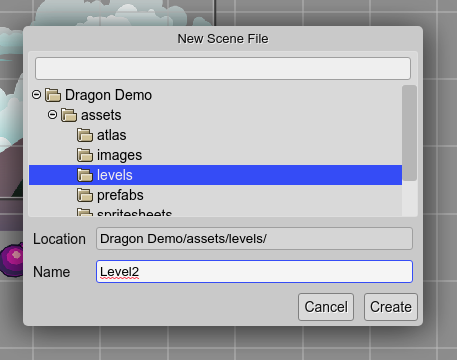
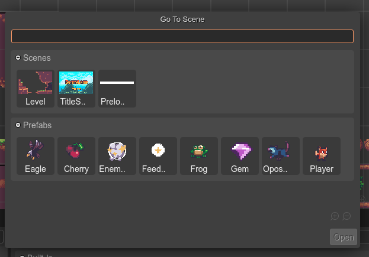

.. include:: ../_header.rst

Create a new Scene file
-----------------------

These are the steps to create a new scene file:

#. Open the `New File dialog <../workbench/new-file-dialog.html>`_.

#. Select the **Scene File** option. This opens the **New Scene File** dialog.

#. In the new dialog, select the location of the new file.

#. Write the name of the scene file. The ``.scene`` extension is added automatically, if not set.

#. Press the **Create** button. The file will be created and opened in the |SceneEditor|_.



Settings
````````

When a new scene is created, it will use the default settings. However, if there are other scene files, some general settings will be taken from the latest modified scene. This allows to keep the same general settings for all the scenes of your project. In the future, we should implement a better way to set general project settings.

These are the settings that are copied when creating a new scene file:

* **borderX**
* **borderY**
* **borderWidth**
* **borderHeight**
* **compilerOutputLanguage**
* **compilerInsertSpaces**
* **compilerTabSize**

Opening a scene file
````````````````````

All files are shown in the |FilesView|_, including the scenes. However, you can open the **Go To File** dialog (``Ctrl+P``), or even better, the **Open Scene File** dialog (``Ctrl+Alt+O``):



You can group the scene files by type (prefab or scene) or by location. Open the context menu for selecting the grouping criteria:

.. image:: ../images/scene-editor-open-scene-file-grouping-02272021.webp
    :alt: Groping scenes.