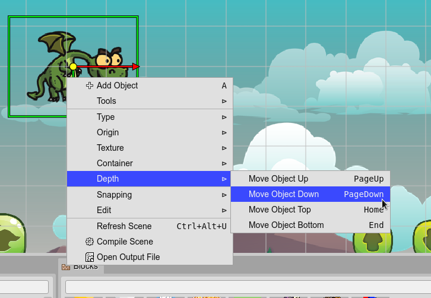

.. include:: ../_header.rst

Display List
------------

The `display list`_ contains the game objects of the scenes. It is part of the  |PhaserAPI|_ (`Phaser.GameObjects.DisplayList <https://photonstorm.github.io/phaser3-docs/Phaser.GameObjects.DisplayList.html>`_). 

The |SceneEditor|_ groups the game objects in a `Display List`_ tree. It is shown in the |OutlineView|_.

.. image:: ../images/scene-editor-display-list-04202020.webp
    :alt: Display List.

You can change the rendering order of an object by moving it in the `display list`_. The context menu shows the **Depth** commands, to move the objects in different directions:

