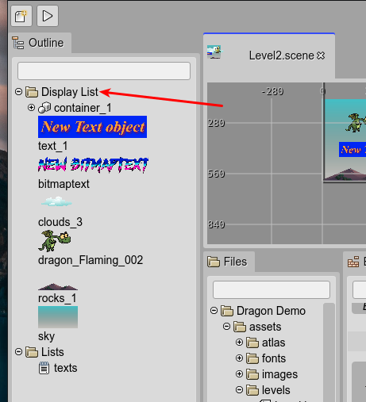

.. include:: ../_header.rst

Display List
------------

The `display list`_ contains the game objects of the scenes. It is part of the  |PhaserAPI|_ (`Phaser.GameObjects.DisplayList <https://photonstorm.github.io/phaser3-docs/Phaser.GameObjects.DisplayList.html>`_). 

The |SceneEditor|_ groups the game objects in a `Display List`_ tree. It is shown in the |OutlineView|_.

You can `change the rendering order of the objects <./working-with-parent-objects.html#changing-the-rendering-order-of-children>`_ in the Display List.