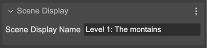
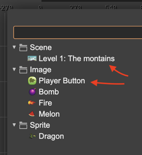
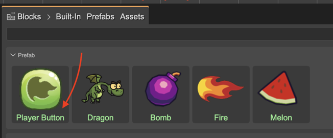

.. include:: ../_header.rst

Display properties
~~~~~~~~~~~~~~~~~~

The **Scene Display** section provides the **Scene Display Name** property. 

By default, the different UI viewers in the editor show the name of the file of the scene as the display name of the scene.  

With the **Scene Display Name** property you can change the display name of the scene. You can use a more descriptive name, like **Level 1: The mountains**:

The display name appears in different UI viewers of the editor, like the **Go To Scene** dialog:

Or in the |BlocksView|_ of the |SceneEditor|_:

